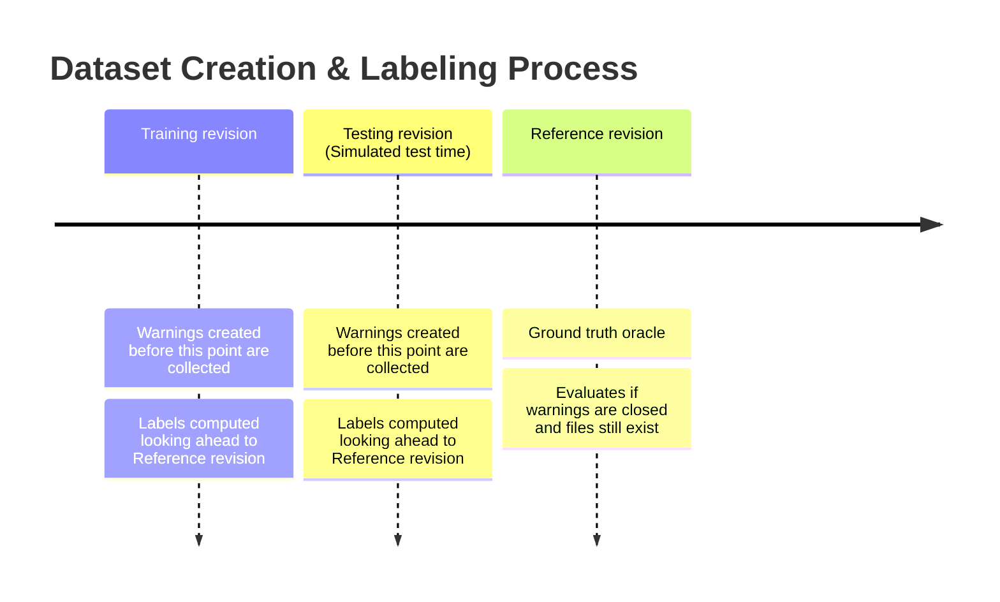
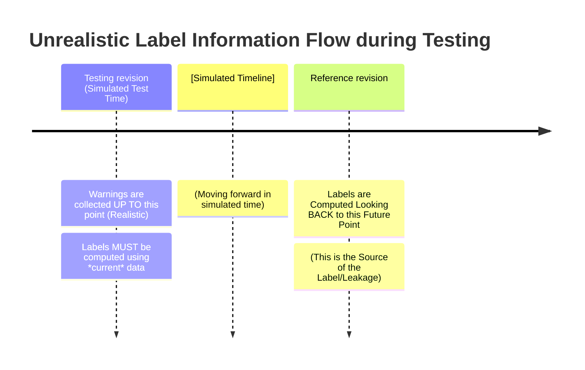
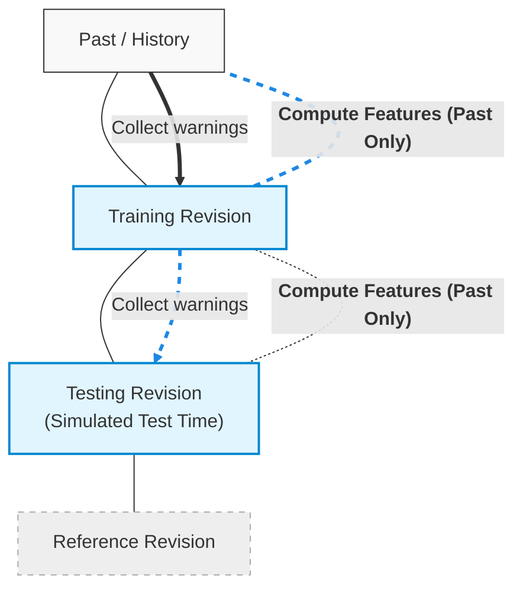

\*\*\*\*# Detecting False Alarms from Automatic Static Analysis Tools:
How Far are We?

**Authors:** Hong Jin Kang, Khai Loong Aw, David Lo **Affiliation:**
Singapore Management University, Singapore **Published:** ICSE '22, May
21--29, 2022, Pittsburgh, PA, USA **DOI:**
https://doi.org/10.1145/3510003.3510214

------------------------------------------------------------------------

## ABSTRACT

Automatic static analysis tools (ASATs), such as Findbugs, have a high
false alarm rate. The large number of false alarms produced poses a
barrier to adoption. Researchers have proposed the use of machine
learning to prune false alarms and present only actionable warnings to
developers. The state-of-the-art study<!-- TODO: What exactlly study, in the reference, do they mean when the say state of the art study? -->

<details style="color:blue;">
<summary>
In Depth --- What is the state-of-the-art study?
</summary>
<p style="color:red;">
Q: What exactlly study, in the reference, do they mean when the say state of the art study?
<p/>

Here, "state-of-the-art study" refers specifically to **Wang et
al. \[53\]**, which systematically analyzed 116 features proposed in
earlier research and identified 23 "Golden Features" that were
particularly effective for predicting actionable Findbugs warnings. The
paper is using \[53\] as the study that established the Golden Features
as the state of the art at that point.


</details>

has identified a set of "Golden Features" based on metrics computed over
the characteristics and history of the file, code, and warning. Recent
studies show that machine learning using these features is extremely
effective and that they achieve almost perfect performance.

We perform a detailed analysis to better understand the strong
performance of the "Golden Features". **We found that several studies
used an experimental procedure that results in data leakage and data
duplication, which are subtle issues with significant implications.**
Firstly, the ground-truth
labels<!-- TODO: What Does  ground-truth labels reffers here?-->


<details style="color:blue;">


<summary>

In Depth --- What are ground-truth labels?

</summary>
<p style="color:red;">
Q: What Does  ground-truth labels reffers here?
<p/>


A **ground-truth label** is the label treated as the correct answer for
a warning when evaluating a machine-learning model. In this paper, each
warning ultimately receives a label such as **actionable** or **false
alarm/unactionable**. The important problem is that these labels are not
necessarily known directly: prior studies generated them automatically
using the closed-warning heuristic.


</details>

have leaked into features that measure the proportion of actionable
warnings in a given context. Secondly, many warnings in the testing
dataset appear in the training
dataset.<!-- TODO: testing / training dataset needs to be explained -->


<details style="color:blue;">


<summary>

In Depth --- What are the training and testing datasets?

</summary>
<p style="color:red;">
Q: testing / training dataset needs to be explained
<p/>


The **training dataset** contains warning examples that the
machine-learning model is allowed to learn from. The **testing dataset**
contains warning examples used only afterward to measure how well the
trained model predicts labels for unseen test examples. In an ideal
experiment, information from the test examples' true labels must not
leak into training or feature computation.


</details>

Next, we demonstrate limitations in the warning
oracle<!-- TODO: very important to understand, is the warning oracle basically the process of flaggin acatiable or not acatiable bugs ? and is that based on hueristic function? -->


<details style="color:blue;">


<summary>

In Depth --- What is the warning oracle and how does the heuristic label warnings?

</summary>
<p style="color:red;">
Q: very important to understand, is the warning oracle basically the process of flaggin acatiable or not acatiable bugs ? and is that based on hueristic function?
<p/>


Yes, essentially. The **warning oracle** is the procedure used to decide
what label a warning gets in the dataset. In this paper the oracle is
the **closed-warning heuristic**: compare a warning in the test/training
revision with a later reference revision. If it disappears while its
file remains, label it actionable; if it remains, label it a false
alarm. So the oracle is the labeling mechanism, while the heuristic is
the rule used by that mechanism.


</details>

that determines the ground-truth labels, a heuristic comparing warnings
in a given revision to a reference revision in the future. We show the
choice of reference revision influences the warning distribution.
Moreover, the heuristic produces labels that do not agree with human
oracles. Hence, the strong performance of these techniques previously
seen is overoptimistic of their true performance if adopted in practice.
Our results convey several lessons and provide guidelines for evaluating
false alarm detectors.

**CCS CONCEPTS:** Software and its engineering → Software defect
analysis.

**KEYWORDS:** static analysis, false alarms, data leakage, data
duplication

------------------------------------------------------------------------

## 1 INTRODUCTION

It has been 15 years since Findbugs \[5\] was introduced to detect bugs
in Java programs. Along with other automatic static analysis tools
(ASATs) \[8, 41, 43\], FindBugs aims to detect incorrect code by
matching code against bug patterns \[5, 18\], for example, patterns of
code that may dereference a null pointer. Since then, many projects have
adopted these tools as they help in detecting bugs at low cost. However,
these tools do not guarantee that the warnings are real bugs. Many
developers do not perceive the warnings by ASATs to be relevant due to
the high incidence of effective false alarms \[19, 43, 52\].<!-- TODO: why would a warning from findbugs or other ASAT even be considered by developers as false alarms? , I mean don't the tools give a very explicit warning about a code that means this code is wrong ? , or do they operate in a manner that also just guess that a code might be proune to bugs in the futuere? -->
<details style="color:blue;">
<summary>In Depth --- Why can ASAT warnings be considered false alarms?</summary>
<p style="color:red;">
Q: why would a warning from findbugs or other ASAT even be considered by developers as false alarms? , I mean don't the tools give a very explicit warning about a code that means this code is wrong ? , or do they operate in a manner that also just guess that a code might be proune to bugs in the futuere?
<p/>

FindBugs and other ASATs do not generally claim that every warning means the code is definitely wrong. They work by matching the source code against predefined **bug patterns** that may indicate a bug. For example, a pattern may indicate that code could dereference a null pointer, but the tool may not have enough context to know whether that situation will actually occur.

Therefore, a warning can be a **false alarm** even though FindBugs correctly detected the pattern it was designed to detect. The surrounding context may make the apparently problematic code intentional or safe. The paper gives an example where the code appears to exhibit buggy behavior, but comments explain that the behavior is actually expected. Developers can also explicitly suppress such warnings using FindBugs filter files.

The paper uses an even broader definition of false alarm: a warning can be considered a false alarm when developers do not act on it because they do not consider it a bug or because fixing it is too risky. Therefore, the paper is interested not only in whether the static analyzer technically identified a suspicious code pattern, but in whether the resulting warning is **actionable for developers**.

In short:

**ASAT:** "This code matches a pattern that may indicate a bug."

**Developer:** "Given the actual context, is this something I should act on?"

If the answer is no, the warning may be considered a false alarm.

</details>
 Prior work
has suggested that the false positive rate may range up to 91%. While
the overapproximation of static analysis may cause false alarms, false
alarms do not only refer to errors from analysis or overapproximation,
but include warnings that developers did not act on \[19, 43, 44\].
Developers may not act on a warning if they do not think the warning
represents a bug or believe that a fix is too risky.

To address the high rate of false alarms, many researchers \[15, 53\]
have proposed techniques to prune false alarms and identify actionable
warnings, which are the warnings that developers would fix. These
approaches \[12, 13, 23, 25, 27, 42, 45, 55, 59\] consider different
aspects of a warning reported by Findbugs in a project, including
factors about the source code \[12\], repository history \[55\], file
characteristics \[29, 59\], and historical data about fixes to Findbugs
warnings \[27\] within the project. Wang et al. \[53\] completed a
systematic evaluation of the features that have been proposed in the
literature and identified 23 "Golden Features", which are the most
important features for detecting actionable Findbugs warnings. Using
these features, subsequent studies \[56--58\] show that any machine
learning technique,
e.g. SVM<!-- TODO: what is SVM stands for -->


<details style="color:blue;">


<summary>

In Depth --- What does SVM stand for?

</summary>
<p style="color:red;">
Q: what is SVM stands for
<p/>


**SVM** stands for **Support Vector Machine**. It is a supervised
machine-learning algorithm that learns a boundary separating
classes---in this case, actionable warnings from false alarms. A linear
SVM tries to find a decision boundary that separates the two classes
using the warning features.


</details>

, performs effectively and that the use of a small number of training
instances can train effective models. In these studies, performances of
up to 96% Recall and 98% Precision, and 99.5%
AUC<!-- TODO: what does AUC stands for -->


<details style="color:blue;">


<summary>

In Depth --- What does AUC stand for?

</summary>
<p style="color:red;">
Q: what does AUC stands for
<p/>


**AUC** stands for **Area Under the Receiver Operating Characteristic
Curve** (ROC AUC). It measures how well a classifier ranks/separates
actionable warnings from false alarms across different decision
thresholds. An AUC of 1.0 means perfect separation; 0.5 corresponds to
random-level discrimination.


</details>

can be achieved. A perfect predictor has a Recall, Precision, and AUC of
100%, suggesting that machine learning techniques using the Golden
Features are almost perfect.

Although the Golden Features have been shown to perform well, we do not
know why they are effective. Therefore, in this work we seek to get a
deeper understanding of the Golden Features. We find a few issues:
First, the ground-truth label was leaked into the features measuring the
proportion of actionable warnings in a given context. Second, warnings
in the test data were used for training. To understand their impact, we
addressed the two flaws and found that the performance of the Golden
Features declines. Our results show that the use of the Golden Features
do not substantially outperform a strawman baseline that predicts all
warnings are
actionable.<!-- TODO: explain what exactlly is a strawman techniceue -->


<details style="color:blue;">


<summary>

In Depth --- What is a strawman technique?

</summary>
<p style="color:red;">
Q: explain what exactlly is a strawman techniceue
<p/>


A **strawman technique/baseline** is deliberately simple. It is not
intended to be a sophisticated solution; it provides a reference point
that a proposed technique should ideally beat. Here the main strawman
predicts **every warning is actionable**. If the sophisticated Golden
Features model cannot clearly outperform that trivial rule, its
practical value is questionable.


</details>

Next, we investigate the warning oracle used to obtain ground-truth
labels when constructing the
dataset<!-- TODO: Very important, explain to me in simple terms, is that the entire process of basically predicting which warning are actiable or not, what is the process what is the dataset? , is the dataset the final clasiification of actiable / vs not actiable warnings -->


<details style="color:blue;">


<summary>

In Depth --- How does the warning-classification process and dataset work?

</summary>
<p style="color:red;">
Q: Very important, explain to me in simple terms, is that the entire process of basically predicting which warning are actiable or not, what is the process what is the dataset? , is the dataset the final clasiification of actiable / vs not actiable warnings
<p/>


Think of the whole process as four stages: **(1) collect warnings → (2)
assign labels → (3) train a classifier → (4) predict labels for new
warnings**. The dataset is the collection of warning instances together
with their labels. The closed-warning heuristic is used to create those
labels automatically. The Golden Features are then inputs to the
machine-learning classifier; they are not themselves the oracle. At
deployment time, the classifier receives features of a new warning and
predicts whether it is actionable or a false alarm.


</details>

. To evaluate any proposed approach, a large dataset should be built,
where each warning is accurately labeled as either an actionable warning
or a false alarm. Many studies \[53, 56, 58\] use a heuristic, which we
term the closed-warning heuristic, as the warning oracle to determine
the actionability of a warning, checking if the same warning is reported
in a reference revision, a revision chronologically after the testing
revision. If the file is still present and the warning is not reported
in the reference revision, then the warning is closed and is assumed to
be fixed. It is, therefore, assumed to be actionable. Conversely, a
warning that remained open is a false alarm. A revision made a few years
after the simulated time of the experimental setting is used as the
reference revision. Prior studies \[53, 56, 58\] selected reference
revisions set 2 years after the testing revision. However, no prior work
has investigated the robustness of the
heuristic.<!-- TODO: I belive this pargraph is very important in understaning the entire paper, I would like it explained in simple terms, if I understand correctlly, is this basically taking a testing code, in a git point in time and then taking another snapshot of the code in a 2 years after in. the git and comparing to see if the warning still exsists, right? , is that basically the huerisitic?, and how is that huerisitic will now work on new warnings, in the current code we have, is that because, we classfied wrning and use the huersitic to say, ha, this type of warning, the huersitic predicts is a false alaram?, is that how it works? -->


<details style="color:blue;">


<summary>

In Depth --- How does the closed-warning heuristic work over time?

</summary>
<p style="color:red;">
Q: I belive this pargraph is very important in understaning the entire paper, I would like it explained in simple terms, if I understand correctlly, is this basically taking a testing code, in a git point in time and then taking another snapshot of the code in a 2 years after in. the git and comparing to see if the warning still exsists, right? , is that basically the huerisitic?, and how is that huerisitic will now work on new warnings, in the current code we have, is that because, we classfied wrning and use the huersitic to say, ha, this type of warning, the huersitic predicts is a false alaram?, is that how it works?
<p/>


Yes, your basic understanding is correct. Imagine Git history as
snapshots in time:

**Training revision → Testing revision → 2-year-later reference
revision**

For a warning observed at the testing revision, the heuristic looks at
the reference revision. If the warning is gone and its file still
exists, it labels the warning **actionable**; if it is still there, it
labels it **false alarm**.

The important point is that this is mainly a **way of creating
historical training/testing labels**, not a prediction mechanism used on
a genuinely new warning today. The researchers already know what
happened in the future because they have the project's Git history. A
real deployed classifier cannot wait two years to discover the label.
This is exactly why using the future reference revision inside features
creates data leakage.

Also, the heuristic is applied to **individual warning instances**, not
to a warning type once and then permanently classifying every future
warning of that type.


</details>

There are several desirable qualities of a warning oracle. Firstly, it
should allow the construction of a sufficiently large dataset. Secondly,
it should be reliable; the labels should be robust to minor changes in
the oracle. Thirdly, it should generate labels that human annotators and
developers of projects using ASATs agree with. An advantage of the
closed-warning heuristic is that it enables the construction of a large
dataset. However, our experiments demonstrate the lack of consistency in
the labels given changes in the choice of the reference revision. This
may allow different conclusions to be reached from the experiments. Our
experiments also uncover that the oracle does not always produce labels
that human annotators or developers agree with. These limitations show
that alone, the heuristic do not always produce trustworthy labels.
After removing unconfirmed actionable warnings, the effectiveness of the
Golden Features SVM improves, indicating the importance of clean
data<!-- TODO: so this is a bit confidung, didn't the effectivness of the golden featueres were supposed to go down in this paper?, I mean don't the autors say that after fixing some wrong pre assumenptions the golden featueres actually don't do very well?, please explain -->


<details style="color:blue;">


<summary>

In Depth --- Why did Golden Features performance decline after fixing the experimental flaws?

</summary>
<p style="color:red;">
Q: so this is a bit confidung, didn't the effectivness of the golden featueres were supposed to go down in this paper?, I mean don't the autors say that after fixing some wrong pre assumenptions the golden featueres actually don't do very well?, please explain
<p/>


Both statements are true, but they refer to different experiments. The
authors initially **replicate the impressive performance** reported by
earlier work, obtaining high F1/AUC. They then discover that the
experimental setup contains **data leakage and duplicated
training/testing warnings**. After removing those problems, performance
drops dramatically. So the paper's central point is not that the Golden
Features never work; rather, their previously reported near-perfect
performance was substantially **overestimated** by flaws in the
experimental setup.


</details>

.

Finally, we highlight lessons learned from our experiments. Our results
show the need to carefully design an experimental procedure to assess
future approaches, comparing them against appropriate baselines. Our
work points out open challenges in the design of a warning oracle for
the construction of a benchmark. Based on the lessons learned, we
outline several guidelines for future work.

We make the following contributions:

-   We analyze the reasons for the strong performance from the use of
    the "Golden Features" observed in prior studies. Contrary to prior
    work, we find that machine learning techniques are not almost
    perfect, and that there is still much room for improvement for
    future work in this area.
-   We study the warning oracle, the closed-warning heuristic, that
    assigns labels to warnings used in previous studies. We show that
    the heuristic may not be sufficiently robust.
-   We discuss the lessons learned and their implications. Importantly,
    we highlight the need for community effort in building an accurate
    benchmark and suggest that future studies compare new approaches
    with strawman baselines.

The rest of the paper is structured as follows. Section 2 covers the
background of our work. Section 3 presents the design of the study.
Section 4 analyzes the Golden Features. Section 5 investigates the
closed-warning heuristic. Section 6 discusses lessons learned from our
study. Section 7 presents related work. Finally, Section 8 concludes the
paper.

------------------------------------------------------------------------

## 2 BACKGROUND

### 2.1 Automatic Static Analysis Tools

Many researchers have proposed Automatic Static Analysis Tools (ASATs),
such as Findbugs \[5\], to detect possible bugs during the software
development process. Research has shown these tools are useful and
succeed in detecting bugs that developers are interested in at low cost.
Compared to program verification or software testing, these tools rely
on bug patterns written by the authors of the static analysis tools,
matching code that may be buggy. Findbugs includes over 400 bug patterns
that match a range of possible bugs, such as class casts that are
impossible, null pointer dereferences, and incorrect synchronization.

Studies have also shown that ASATs are able to detect real bugs \[11,
49\]. Indeed, static analysis tools are adopted by large companies \[4,
8, 43\] and open source projects \[7\] to detect bugs. Developers may
run them during local development, use them in Continuous Integration
\[60\] and during code review to detect buggy code to catch bugs early
\[6, 36, 50, 52\]. Projects may configure the tools \[60\], for example,
to suppress false alarms by configuring a filter file to exclude
specific warnings \[2\].

Developers largely perceive ASATs to be relevant, and the majority of
practitioners have used or heard of ASATs \[35, 48, 52\]. Still, these
tools are characterized by the large amounts of false alarms that they
produce, and among other reasons, this has led to resistance in adopting
them in many software projects \[19\].

### 2.2 Distinguishing between Actionable Warnings and False Alarms

To minimize the overhead of inspecting false alarms, researchers have
proposed approaches based on machine learning to rank or classify the
warnings. A large number of features have been designed over the past 15
years; for example, based on software metrics (e.g. size of the file,
number of comments in the code), source code history (e.g. number of
lines of code recently added to a file), and characteristics and history
of the warnings (e.g. the number of revisions where the warning has been
opened).

Researchers have evaluated their proposed tools through datasets of
warnings produced by Findbugs \[12--14, 16, 42, 45, 59\]. Recently, Wang
et al. \[53\] performed a systematic analysis of the features proposed
in the literature. From 116 features, they identified 23 Golden
Features, which are the features that achieve effective performance. The
features are listed in Table 1. These features include metrics such as
the code-to-comments ratio \[29\], and the number of lines added in the
past \[14, 42\]. Of note are several features of the "Warning
combination" feature type. We will refer to three of these features,
**warning context in method**, **warning context in file**, and
**warning context for warning type**, as the warning context features.
We refer to another two features, the **defect likelihood for warning
pattern**, and **discretization of defect likelihood** as the defect
likelihood features. These features are various measures of the
proportion of actionable warnings within a population of warnings,
building on top of the insight that warnings within the population share
the same label, e.g. if a warning was previously fixed in a file, it is
more likely that the other warnings in the same file will be fixed too.

**Table 1: The Golden Features studied in prior work \[53, 56, 58\].**
**A warning context is defined \[53\] as the difference of the number of
actionable warnings and false alarms divided by the total number of
warnings reported in a given method/file, or for a warning pattern.**

  | Feature type | Feature |
|---|---|
| Warning combination | warning context in method |
| | warning context in file |
| | warning context for warning type |
| | defect likelihood for warning pattern |
| | discretization of defect likelihood |
| | average lifetime for warning type |
| Code characteristics | comment-code ratio |
| | method depth |
| | file depth |
| | # methods in file |
| | # classes in package |
| Warning characteristics | warning pattern |
| | warning type |
| | warning priority |
| | package |
| File history | file age |
| | file creation |
| | developers |
| Code analysis | parameter signature |
| | method visibility |
| Code history | LOC added in file (last 25 revisions) |
| | LOC added in package (past 3 month) |
| Warning history | warning lifetime by revision |

Further research \[56\] on the Golden Features of Wang et al. \[53\]
showed the lack of influence of the choice of machine learning model on
effectiveness. They suggested that a linear SVM was optimal since it
requires a lower cost of training. In contrast, while a deep learning
approach achieves similar levels of effectiveness, it has a longer
training time. Their analysis \[56\] suggested that the detection of
false alarms is an intrinsically easy problem. A different study \[58\]
demonstrated that, with the Golden Features, only a small proportion of
the dataset has to be labelled to train an effective classifier. The
Golden Features are a subject of our study. In Section 4, we analyze
them in
detail.<!-- TODO: I need to understand please how exactlly do the golden feature come into play in the building of an oracle system that would predict / labeled / give suggestion to a developer if a warning is a false alarm -->


<details style="color:blue;">


<summary>

In Depth --- How do the Golden Features fit into the prediction pipeline?

</summary>
<p style="color:red;">
Q: I need to understand please how exactlly do the golden feature come into play in the building of an oracle system that would predict / labeled / give suggestion to a developer if a warning is a false alarm
<p/>


The Golden Features are simply the **input variables (features)** given
to the machine-learning classifier. For example, they include
information about the warning, its file, code characteristics, history,
and---problematically---some measures of how often similar warnings were
previously actionable.

The pipeline is roughly:

**warning → calculate Golden Features → SVM → predicted label →
actionable / false alarm**

The classifier is therefore the component making the prediction. The
Golden Features describe the warning in a numerical form that the
classifier can use. They do not themselves constitute the oracle.


</details>

**Closed-warning heuristic.** The procedure to construct and label the
ground-truth dataset can be visualized in Figure 1. To assess an
approach that detects false alarms, a dataset of Findbugs warnings is
collected. While some researchers \[13, 45\] construct a labelled
dataset through manual labelling of the warnings in a single revision,
other researchers collect a dataset through an automatic ground-truth
data collection process \[12, 13, 53, 56, 58\]. Data for a testing
revision and at least one training revision, set chronologically before
the testing revision, is collected. This simulates real-world use of the
tool, in which training is done on the history of the project, and then
used at the time of the testing revision.

# Figure 1: The dataset comprises warnings created before the training and testing revisions. The labels of each warning are determined by the closed-warning heuristic; if a warning is closed at the reference revision and the file has not been deleted, then it is actionable.



Using the closed-warning heuristic as the warning oracle, each warning
in a given revision is compared against a reference revision set in the
future of the test revision. Prior studies selected a reference revision
set 2 years after the test revision. If a specific warning is no longer
present in the reference revision (i.e., a closed warning), the
heuristic assumes that the warning is actionable. If the warning is
present in both the given and reference revision (i.e., an open
warning), then the heuristic assumes that it is a false alarm. If the
file that contains the code with the warning has been deleted, then the
warning is labelled unknown and is removed from the dataset.

In other words, according to the closed-warning heuristic, a closed
warning is always actionable as long as the file has not been deleted,
and an open warning is always
unactionable.
<!-- TODO: I'm trying to understand if I'm getting this right. so the SVM is essintially the end result tool, correct?, meaning this is the machine learning model that given a warning and the golden featueres, it looks at the warning, see how much golden featueres, it satisifes and spit out a result, which is Actiable / non - actiable , correct ?
And this machine learning model need to be trained to reach this stage, correct?
I need to understand how is it being trained ? , is the close huerosotoc what is traiing it, what exactlly is the job of the training set, the testing set?
I think the closed warning huerstic is during the testing vs revision set is it not, so what is the training set? , or the testing is to see if the model has been trained good enough ? , meaning if it gives the same result as the closed warning huerisitic?
if so, the closed warning juersitic is just a simple tool in case we cann't actually talk to the human developers of the project to understand from them if the warnings are actiable not actaiable, correct ? -->


<details style="color:blue;">


<summary>

In Depth --- How are the Golden Features, the SVM, the training set, the testing set, and the closed-warning heuristic connected?

</summary>
<p style="color:red;">
Q: Is the SVM the final machine-learning model that receives the Golden Features of a warning and predicts whether the warning is actionable or a false alarm? How is the SVM trained, what are the roles of the training and testing datasets, and how does the closed-warning heuristic provide the labels?
<p/>

Yes — your overall understanding is very close, but there is one extremely important distinction to make:

**The SVM is the machine-learning classifier that ultimately makes the prediction. The Golden Features are its inputs. The closed-warning heuristic is not the SVM itself; it is the mechanism used in this study to create the labels that tell the SVM what the "answer" was for historical warnings.**

The complete idea can be understood as four stages:

```text
Historical project warnings
          |
          v
Closed-warning heuristic
          |
          v
Actionable / False alarm labels
          |
          v
Training dataset
          |
          v
      Train SVM
          |
          v
 SVM learns relationship between
 Golden Features and the labels
          |
          v
     Trained SVM
          |
          v
New warning
    |
    v
Calculate its Golden Features
    |
    v
     SVM
    |
    v
Actionable / False alarm
```
</details>
<!-- TODO: interesting!, I need to know if I'm saying an original thought that is not in this paper, and if not that is also ok, just please let's make sure to reference, What I want to say is that it is interesting and can be further developed that if the warning persists in the futuer revision it doesn't mean it's not actiable but it could just mean the developer feel it is too resky to fix. I need to know if the paper adress this in any kind -->


<details style="color:blue;">


<summary>

In Depth --- Can an open warning still be actionable?

</summary>
<p style="color:red;">
Q: interesting!, I need to know if I'm saying an original thought that is not in this paper, and if not that is also ok, just please let's make sure to reference, What I want to say is that it is interesting and can be further developed that if the warning persists in the futuer revision it doesn't mean it's not actiable but it could just mean the developer feel it is too resky to fix. I need to know if the paper adress this in any kind
<p/>


Yes---this is a very important observation, and the paper essentially
supports it. An **open warning does not necessarily mean "false
alarm."** A developer may simply not have inspected it yet, may have
postponed it, or may consider fixing it too risky or costly.

The paper explicitly discusses this possibility in Section 5.1 and
Section 5.3: actionable warnings may remain open for years. In Section
5.3, the authors even find that many open warnings are **not confirmed
as false alarms** by developer-maintained Findbugs filter files. So your
idea is not merely an unrelated new observation; it is closely aligned
with one of the paper's criticisms of the closed-warning heuristic. The
paper's broader point is that **"still present" is not equivalent to
"unactionable."**


</details>

Other than detecting actionable warnings, researchers have applied the
heuristic to identify bug-fixing commits for mining patterns \[32, 33\].
The heuristic is a subject of our study, and we assess its robustness
and its level of agreement with human oracles in Section 5.

------------------------------------------------------------------------

## 3 STUDY DESIGN

### 3.1 Research Questions

**RQ1. Why do the Golden Features work?** This research question seeks
to understand the Golden Features. While previous studies have
highlighted their strong results, there has not been an in-depth
analysis of their practicality. We study the Golden Features and the
dataset used in the experiments by Wang et al. \[53\] and Yang et
al. \[56\]. We investigate the aspects of the features and dataset that
allow accurate predictions by the best performing machine learning
model, an SVM using the Golden Features. We replicate the results of the
previous studies and validate the predictive power of the Golden
Features. To understand the importance of different features, we use
LIME \[39\] to narrow our focus down to the features that contribute the
most to the
predictions.<!-- TODO: can you explain to me what in that ref helped them? -->


<details style="color:blue;">


<summary>

In Depth --- How did LIME help the authors?

</summary>
<p style="color:red;">
Q: can you explain to me what in that ref helped them?
<p/>


LIME (**Local Interpretable Model-agnostic Explanations**) is an
explainable-AI technique. Instead of simply saying "the SVM predicted
actionable," LIME helps answer **"which features were important for this
particular prediction?"**

The authors sampled 50 predictions and asked LIME to identify the
features contributing most to each one. They found that **warning
context of file** and **warning context of package** appeared among the
top three features for every sampled prediction.

That was an important clue: these features were dominating the
predictions, so the authors investigated how they were calculated. This
investigation led them to discover the data leakage.


</details>

Afterwards, we switch to increasingly simpler classifiers and analyze
the experimental data to better understand why the choice of classifiers
did not influence the results in prior studies.

**RQ2. How suitable is the closed-warning heuristic as a warning
oracle?** This research question concerns the suitability of the
closed-warning heuristic as a warning oracle. A good oracle should be
robust, and its judgments should agree with the analysis of a human
annotator. We investigate the robustness of the heuristic, checking the
consistency of labels under different choices of the reference revision.
While previous studies used a 2-years interval between the test revision
and reference revision, we investigate if different conclusions can be
reached with a different time interval. Next, we compute the proportion
of closed warnings that human annotators labelled actionable, and the
proportion of open warnings that project developers suppressed as false
alarms.<!-- TODO: I belive this is the false positive mention later in the paper. please verify and explain, basically is this when the oracle predictions are completlly oposite to the human dession -->


<details style="color:blue;">


<summary>

In Depth --- What is a false positive in this study?

</summary>
<p style="color:red;">
Q: I belive this is the false positive mention later in the paper. please verify and explain, basically is this when the oracle predictions are completlly oposite to the human dession
<p/>


No. Here the authors use **false positive** in the standard
classification sense, not to mean that the oracle and human judgment are
completely opposite.

  Actual label   Model prediction   Result
  -------------- ------------------ -------------------------
  Actionable     Actionable         **True Positive (TP)**
  False alarm    Actionable         **False Positive (FP)**
  Actionable     False alarm        **False Negative (FN)**
  False alarm    False alarm        **True Negative (TN)**

So an FP means specifically: **the model told the developer "this is
actionable," but the warning is actually unactionable.** It does not
mean the entire oracle disagrees with a human decision.


</details>

### 3.2 Evaluation Setting

To analyze the performance of machine learning approaches that identify
actionable Findbugs warnings, we use the same metrics as prior studies
\[53, 56, 58\]. A true positive (TP) is an actionable Findbugs warning
correctly predicted to be actionable. A false positive (FP) is an
unactionable Findbugs warning incorrectly predicted to be actionable.
Note that we use the term false alarm to refer to unactionable Findbugs
warning. A false positive, therefore, refers to a false alarm that is
incorrectly determined to be an actionable warning. A false negative
(FN) is an actionable warning incorrectly predicted to be a false alarm.
A true negative is an unactionable warning correctly predicted to be a
false
alarm.<!-- TODO: I'd like for you to organize this in a chart or table to make sure I can remember easily these 4 cases. -->


<details style="color:blue;">


<summary>

In Depth --- What are the four classification outcomes?

</summary>
<p style="color:red;">
Q: I'd like for you to organize this in a chart or table to make sure I can remember easily these 4 cases.
<p/>


  -----------------------------------------------------------------------
                          **Actually actionable** **Actually false
                                                  alarm**
  ----------------------- ----------------------- -----------------------
  **Predicted             **TP** --- correct      **FP** --- false
  actionable**                                    positive

  **Predicted false       **FN** --- false        **TN** --- correct
  alarm**                 negative                
  -----------------------------------------------------------------------

Easy memory trick: **P = the model predicted Positive (actionable); N =
it predicted Negative (false alarm). T/F says whether that prediction
was correct.**


</details>

We compute Precision and Recall as
follows:<!-- TODO: I think I understand the pression meaning but please explain to me the recall meaning -->


<details style="color:blue;">


<summary>

In Depth --- What does recall mean?

</summary>
<p style="color:red;">
Q: I think I understand the pression meaning but please explain to me the recall meaning
<p/>


**Recall** asks: **"Of all the warnings that really are actionable, how
many did the model successfully find?"**

Recall = TP / (TP + FN)

For example, suppose there are 100 genuinely actionable warnings and the
model identifies 90 of them as actionable. Then recall = 90/100 =
**90%**.

So: - **Precision:** When the model says "actionable," how often is it
right? - **Recall:** Of all the actionable warnings that exist, how many
did it find?

A high-recall system misses few actionable warnings.


</details>

    Precision = TP / (TP + FP)

    Recall = TP / (TP + FN)

Finally, we compute and present F1, the harmonic mean of Precision and
Recall. F1 is known to capture the trade-off between Precision and
Recall, and is used in place of accuracy given an imbalanced dataset. F1
is computed as
follows:<!-- TODO: I need an explanation about this term the harmonic mean, I need to understand what it is, what are the units of messuere?, is it just a number? -->


<details style="color:blue;">


<summary>

In Depth --- What is the harmonic mean and what are its units?

</summary>
<p style="color:red;">
Q: I need an explanation about this term the harmonic mean, I need to understand what it is, what are the units of messuere?, is it just a number?
<p/>


A **harmonic mean** is a particular mathematical way of averaging
numbers. F1 combines Precision and Recall into **one score between 0 and
1** (or 0%--100%).

F1 = 2 × Precision × Recall / (Precision + Recall)

It is deliberately sensitive to a low value: if Precision is excellent
but Recall is poor, F1 will also be relatively low. This makes it useful
when we want **both** precision and recall to be good.

It has no special physical unit---it is simply a **dimensionless
score**. For example, Precision = 0.8 and Recall = 0.6 gives F1 ≈ 0.69.


</details>

    F1 = 2 × Precision × Recall / (Precision + Recall)

The Area Under the receiver operator characteristics Curve (AUC) is a
measure of the predictive power of a machine learning approach to
distinguish between true and false alarms. Ranging between 0 (worst
discrimination) and 1 (perfect discrimination), AUC is the area under
the curve of the true positive rate against the false positive rate, and
recommended over accuracy when the data is imbalanced. A strawman
classifier that always outputs a single label has an AUC of
0.5.<!-- TODO: I need an explanation about this term also. does it releate to the F1, explain to me in more details by some sore of a graphic example the graph / chars mention in this pargraph -->


<details style="color:blue;">


<summary>

In Depth --- How does AUC relate to F1 and the ROC curve?

</summary>
<p style="color:red;">
Q: I need an explanation about this term also. does it releate to the F1, explain to me in more details by some sore of a graphic example the graph / chars mention in this pargraph
<p/>


AUC and F1 are related in that both evaluate a classifier, but they
measure **different things**.

**F1:** evaluates the classifier at a particular classification decision
and combines Precision + Recall.

**AUC:** looks at the classifier's ability to separate the two classes
over **many possible decision thresholds**.

Imagine a classifier gives every warning a score: higher = "more likely
actionable." The ROC curve plots:

-   **Y-axis:** True Positive Rate = Recall
-   **X-axis:** False Positive Rate

A perfect classifier reaches the top-left corner:

```text
True Positive Rate
1.0 |       ●──────
    |      /
    |     /
    |    /
0.0 |───●────────────
    0.0          1.0
       False Positive Rate
```

The **area under that curve is AUC**. AUC = 1 means perfect separation;
AUC ≈ 0.5 means no useful separation. Thus AUC is not simply another
version of F1: **F1 evaluates one operating point, while AUC summarizes
ranking/separation across thresholds.**


</details>

Our dataset consists of projects that were studied by Yang et al. \[56,
58\] and Wang et al. \[53\]. Similar to previous studies \[56, 58\], we
use one training revision and one testing revision. We use the same
testing revision as previous studies \[53, 56, 58\]. We train one model
for each
project.<!-- TODO: I need to make sure I understand the differnet terms of testing , training and reference revisions, are these snapshots of the code in differnt times ? , I need to make sure I know exactlly how they are organized chronoligacl -->


<details style="color:blue;">


<summary>

In Depth --- How are training, testing, and reference revisions organized?

</summary>
<p style="color:red;">
Q: I need to make sure I understand the differnet terms of testing , training and reference revisions, are these snapshots of the code in differnt times ? , I need to make sure I know exactlly how they are organized chronoligacl
<p/>


Yes. In this paper, **training, testing, and reference revisions are
snapshots/points in the project's version history**.

Chronologically:

```text
PAST                                      FUTURE
  |                                         |
  v                                         v
[Training revision] → [Testing revision] → [Reference revision]
       learn from          evaluate on          create labels
       this data           this data             using future
```

The training revision is before the testing revision. The reference
revision is even later---typically **2 years after the testing
revision** in the earlier studies.

The key distinction is that the **reference revision is not another
training/test set**. It is used by the closed-warning heuristic to
determine what label a historical warning receives.


</details>


------------------------------------------------------------------------

## 4 ANALYSIS OF THE GOLDEN FEATURES

To answer the first research question, we investigate the performance of
the Golden Features by first using the same dataset used by Yang et
al. \[56\]. The dataset includes two revisions from 9 projects. The
testing revisions are the revisions of the projects on 1 January 2014,
and the training revision is a revision of the projects up to 6 months
before the testing revision. In total, 31,058 warning instances were
obtained by running Findbugs over the training and testing revision. On
average, 14.1% of the warnings in the dataset were actionable. Table 2
shows the breakdown of the warnings.

We successfully replicate the performance observed in the experiments of
Yang et al. \[56\] and Wang et al. \[53\], obtaining high
AUC<!-- TODO: remind me what AUC stnds for? -->


<details style="color:blue;">


<summary>

In Depth --- What does AUC stand for?

</summary>
<p style="color:red;">
Q: remind me what AUC stnds for?
<p/>


**AUC = Area Under the Receiver Operating Characteristic Curve.** It
measures how well the classifier separates actionable warnings from
false alarms across different classification thresholds.


</details>

values of up to 0.99. An average F1 of 0.88 was obtained, with F1
ranging from 0.65 to 0.95. Table 3 shows our experimental results.

**Table 2: The number of training, testing instances, and the percentage
of actionable warnings (Act. %) in the dataset. The testing revision is
the last revision checked into the main branch on 2014-01-01.**

  | Project | Training | With duplicates | | W/o duplicates | |
|---|---|---|---|---|---|
| | | testing | Act. % | testing | Act. % |
| ant | 1229 | 1115 | 5% | 21 | 71% |
| cassandra | 2584 | 2601 | 14% | 551 | 70% |
| commons | 725 | 786 | 5% | 4 | 50% |
| derby | 2479 | 2507 | 5% | 499 | 31% |
| jmeter | 604 | 613 | 24% | 57 | 19% |
| lucene | 3259 | 3425 | 34% | 893 | 59% |
| maven | 813 | 818 | 3% | 149 | 14% |
| tomcat | 1435 | 1441 | 23% | 227 | 41% |
| phoenix | 2235 | 2389 | 14% | 214 | 22% |

Yang et al. \[56\] found that the dataset was intrinsically easy as the
data was inherently low dimensional. To further analyze their findings,
we used tools from the field of explainable AI, in particular LIME
\[39\], to identify the most important features contributing to each
prediction. LIME is an explanation technique that identifies the most
important features that contributed to an individual prediction. To
identify the most important features, we sampled 50 predictions made by
the Golden Features SVM, and used LIME to identify the top features
contributing to the predictions. We found that two features, **warning
context of file** and **warning context of package**, appeared in the
top-3 features of every
prediction.<!-- TODO: I need a more in deoth explanation for this pargraph -->


<details style="color:blue;">


<summary>

In Depth --- What is LIME doing in this paragraph?

</summary>
<p style="color:red;">
Q: I need a more in deoth explanation for this pargraph
<p/>


The important idea is that **LIME = Local Interpretable Model-agnostic
Explanations**. Instead of simply reporting that a classifier made a
prediction, LIME helps identify which input features contributed most
strongly to an individual prediction.

The authors sampled 50 predictions from the Golden Features SVM and ran
LIME on them. They found that **warning context of file** and **warning
context of package** were among the top three features in every sampled
prediction.

That finding told them that these features were unusually influential.
They therefore inspected their implementation, which led them to
discover that these features were using labels derived from the future
reference revision. In other words, LIME helped them **find the
suspicious features that led them to the data-leakage discovery**.


</details>

**Warning context and defect likelihood features.** On analyzing the
source code of the feature
extractor<!-- TODO: very important I need an explanation, is this basically a code developed to identify featueres , extract fetuers ? , please explain -->


<details style="color:blue;">


<summary>

In Depth --- What is a feature extractor?

</summary>
<p style="color:red;">
Q: very important I need an explanation, is this basically a code developed to identify featueres , extract fetuers ? , please explain
<p/>


Yes. The **feature extractor** is essentially the code that takes a raw
warning plus its surrounding information and **calculates the
numerical/features that the machine-learning model will receive**.

Conceptually:

```text
Raw warning + source code + project history
                 ↓
          Feature extractor
                 ↓
      [feature1, feature2, ..., feature23]
                 ↓
                SVM
                 ↓
       actionable / false alarm
```

The authors inspected Wang et al.'s feature-extraction implementation
and discovered that five features were calculated using information that
should not have been available when making the prediction.


</details>

developed by Wang et al. \[53\], we found a subtle data
leak<!-- TODO: I need you to explain to me in details this data leak and it effected poorleyy on the overhaul result -->


<details style="color:blue;">


<summary>

In Depth --- What is the data leakage and how did it affect the results?

</summary>
<p style="color:red;">
Q: I need you to explain to me in details this data leak and it effected poorleyy on the overhaul result
<p/>


The key problem is that five Golden Features use the **labels of other
warnings**, and those labels were themselves obtained by looking into
the **future reference revision**.

For example, suppose the classifier is trying to predict warning W at
the testing revision. The "warning context of file" feature asks
something like: **"What proportion of warnings in this file are
actionable?"**

But to calculate that proportion, the implementation used the
closed-warning heuristic to determine which warnings were actionable.
That heuristic looks at the future reference revision.

So information flows like this:

```text
Future reference revision
          ↓
closed-warning heuristic
          ↓
labels of warnings
          ↓
Golden Feature for W
          ↓
classifier predicts W
```

The problem is that the future label of W itself can be included in the
feature calculation. The classifier therefore receives information
derived from the very answer it is supposed to predict.

This is **data leakage**: information that would not be available at
prediction time has entered the model's input.

That explains the dramatic result: average F1 fell from **0.88 to 0.38**
when the five leaked features were removed. The impressive original
performance was therefore substantially dependent on information that
would be unavailable in real use.


</details>

in the implementation of the warning context and defect likelihood
features. These features utilize findings from previous studies \[27\]
that found that the warnings within a population (e.g. warnings in the
same file) tend to be homogenous; if one warning is a false alarm, then
the other warnings in the same population tend to be false alarms as
well. Including warning context of file and warning context of package,
there are another 3 features computed similarly (warning context of
warning type, defect likelihood for warning pattern, Discretization of
defect likelihood for warning pattern). At a high level, the warning
context features are computed as follows:

    warning_context = (|W_actionable_relevant| - |W_false_alarm_relevant|) / |W_relevant|

W_relevant refers to the set of warnings relevant to the feature type.
For example, W_relevant of warning context of file considers the
warnings that are reported in a given file, while W_relevant of warning
context of warning type considers all warnings for the given category of
patterns (e.g. STYLE, INTERNATIONALIZATION). Note that a warning pattern
refers to a specific bug pattern in Findbugs
(e.g. "ES_COMPARING_STRINGS_WITH_EQ"), and a warning type is a category
of patterns. The **defect likelihood for warning pattern** \[45\]
feature computes the proportion of warnings that were actionable out of
all warnings with the given bug pattern,
p:<!-- TODO: is D(p) in the below formula is what they reffer as the defect likelihood for warning pattern, is this basically a fraction, meaning 1/2 is 50% ? -->


<details style="color:blue;">


<summary>

In Depth --- What is D(p) and what does defect likelihood mean?

</summary>
<p style="color:red;">
Q: is D(p) in the below formula is what they reffer as the defect likelihood for warning pattern, is this basically a fraction, meaning 1/2 is 50% ?
<p/>


Yes. **D(p)** is the defect likelihood for warning pattern **p**. It is
a proportion/fraction:

D(p) = number of actionable warnings with pattern p / total number of
warnings with pattern p

So if a particular Findbugs pattern appears 100 times and 50 of those
warnings are labelled actionable, then D(p) = 50/100 = **0.5 (50%)**.

The problem is that, in the original implementation, those "actionable"
labels were obtained using the future reference revision, which is part
of the data-leakage problem.


</details>

    D(p) = |W_actionable_relevant| / |W_relevant|

The **discretization of defect likelihood for warning type** \[45\]
feature, computed for each type/category T of bug patterns, is a measure
of the difference in defect likelihood from the defect likelihood of T
for each bug pattern in the category:

    discretization = sqrt( (1 / (|T| - 1)) * sum_{p in T} (D(p) - D(T))^2 )

The five warning context and defect likelihood features require
information about the actionability of each warning in the population of
warnings considered. A data leakage occurs when the classifier utilizes
information that is unavailable at the time of its predictions \[22,
51\]. As shown in Figure 2, while the ratio of actionable warnings are
computed over the warnings reported in the past (the black line in
Figure 2), the closed-warning heuristic to determine the ground-truth
label of a warning (the red lines in Figure 1 and Figure 2) is utilized
to determine if these warnings were actionable. To compute the warning
context of a given warning, W_t in the testing revision, the labels of
all warnings in the population of warnings (e.g. all warnings in the
same file), including W_t, are obtained based on comparison to the
reference revision.

Since the ground-truth label is also obtained based on comparison to the
reference revision, the ground-truth label is inadvertently leaked into
the computation of the warning context. This is not a realistic
assumption in practice; at test time, the ground-truth label of the
warning context of W_t is the target of the prediction. While checking
if a warning will be closed 2 years in the future is possible within an
experiment, there is no way to check if the warnings will be closed 2
years into the future in practice. Table 3 shows the large drop in F1,
from an average of 0.88 to 0.38, when these five features are dropped.
We refer to these features as leaked
features.<!-- TODO: what are these featueres exactlly -->


<details style="color:blue;">


<summary>

In Depth --- What are the five leaked features?

</summary>
<p style="color:red;">
Q: what are these featueres exactlly
<p/>


The "leaked features" are the five Golden Features whose calculation
uses actionability labels derived from the future reference revision:

1.  **Warning context in method**
2.  **Warning context in file**
3.  **Warning context for warning type**
4.  **Defect likelihood for warning pattern**
5.  **Discretization of defect likelihood**

They are called leaked because calculating them uses information about
which warnings eventually became closed/actionable---information
unavailable when a real system is asked to classify a current warning.


</details>

> The computation of the warning context and defect likelihood features
> caused data leakage, as it used labels determined by comparison
> against the reference revision, chronologically in the future of the
> testing time.

**Table 3: Effectiveness of an SVM using the Golden Features after
removing the leaked features and removing the duplicate warnings between
the training and testing dataset.** The numbers in parentheses are the
F1 obtained by the baseline classifier that predicts all warnings are
actionable.

  | Project | All Golden Features | | − leaked features | | − data duplication | | − leak, duplication | |
|---|---|---|---|---|---|---|---|---|
| | F1 | AUC | F1 | AUC | F1 | AUC | F1 | AUC |
| ant | 0.94 (0.09) | 1.00 | 0.11 (0.09) | 0.67 | - | - | - | - |
| cassandra | 0.92 (0.24) | 1.00 | 0.45 (0.24) | 0.86 | 0.9 (0.41) | 0.99 | 0.29 (0.41) | 0.54 |
| commons | 0.65 (0.10) | 0.99 | 0.16 (0.10) | 0.65 | 0.75 (0.25) | 0.97 | 0.11 (0.25) | 0.49 |
| derby | 0.95 (0.09) | 1.00 | 0.39 (0.09) | 0.93 | 0.97 (0.28) | 0.97 | 0.30 (0.28) | 0.59 |
| jmeter | 0.94 (0.38) | 0.99 | 0.53 (0.38) | 0.76 | 1.00 (0.14) | 1.00 | 0.25 (0.14) | 1.00 |
| lucene-solr | 0.87 (0.51) | 0.97 | 0.59 (0.51) | 0.74 | 0.87 (0.53) | 0.98 | 0.23 (0.53) | 0.62 |
| maven | 0.86 (0.07) | 1.00 | 0.27 (0.07) | 0.9 | 0.95 (0.24) | 0.99 | 0.27 (0.24) | 0.58 |
| tomcat | 0.93 (0.37) | 1.00 | 0.48 (0.37) | 0.73 | 0.95 (0.70) | 1.00 | 0.65 (0.70) | 0.39 |
| phoenix | 0.89 (0.25) | 1.00 | 0.42 (0.25) | 0.78 | 0.83 (0.37) | 0.99 | 0.40 (0.37) | 0.63 |
| Average | 0.88 (0.23) | 1.00 | 0.38 (0.23) | 0.76 | 0.90 (0.37) | 0.99 | 0.31 (0.37) | 0.59 |

**Baseline using data leakage.** Data leakage leads to an experimental
setting that overestimates the effectiveness of the classifier under
study \[22, 51\]. In Table 4, we show that a baseline equivalent to the
Golden Features can be developed using only the five leaked features.
Using just the leaked features with an SVM, we construct a baseline that
achieves performance comparable to the use of the Golden Features. An
SVM using the leaked features has a Precision of 0.79, about 0.10 lower
than the Golden Features SVM, however, they achieve identical Recall of
0.94, which results in an F1 of 0.83, just 0.05 lower than the Golden
Features.

# Figure 2: The warning context and defect likelihood features use labels derived through the closed-warning heuristic, using information from the reference revision, chronologically in the future of the test revision. In a realistic setting, this information will not be present at test time.



This indicates that the strong performance of the Golden
Features in the experiments depends largely on the leaked features, and
is an optimistic estimate of their
effectiveness.<!-- TODO: I need an explanation for this pragraph -->


<details style="color:blue;">


<summary>

In Depth --- What is kNN and how did it reveal data duplication?

</summary>
<p style="color:red;">
Q: I need an explanation for this pragraph
<p/>


The important idea is that **kNN = k-Nearest Neighbors** does not learn
a complicated mathematical model in the same way an SVM does. It looks
at the training examples that are most similar to the new example and
uses their labels.

With **k = 1**, it simply finds the single most similar training warning
and copies its label.

That produced surprisingly strong results. The authors then noticed that
the training and testing sets contained many **identical warning
instances**. Therefore, a test warning could often find essentially the
same warning in the training set.

So the classifier did not need to generalize well to genuinely new
warnings---it could effectively recognize examples it had already seen.
This was a major clue that data duplication was inflating the reported
performance.


</details>

**Data duplication.** Next, we progressively selected simpler machine
learning models and surprisingly, found that a k-Nearest Neighbors (kNN)
classifier performs effectively. In particular, we found a surprising
trend where the lower values of k led to better results. The results of
the experiment where we iteratively lowered k to consider in the
prediction are shown in Table 4.

Surprisingly, a kNN classifier with k=1 (i.e., only one neighbor is
considered to make a prediction) produces the best result, obtained a
Precision of 0.87, a Recall of 0.90, with an F1 of 0.84. With k=1, the
classifier was selecting a single most similar warning in the training
dataset. In typical usage of kNN, a low value of k may cause the
classifier to be influenced by noise and outliers, which makes the
strong results surprising. To analyze the results further, we observed
that the number of training (15,363) and testing instances (15,695) were
similar, and we investigated the data carefully. We found that many
testing instances appeared in both the training and testing
dataset.<!-- TODO: I need an explanation for the data duplication also -->


<details style="color:blue;">


<summary>

In Depth --- What is data duplication?

</summary>
<p style="color:red;">
Q: I need an explanation for the data duplication also
<p/>


The duplication is a second, separate experimental flaw.

Suppose:

```text
Training revision       Testing revision
      |                       |
      W  --------------------> W
   same warning            same warning
```

The same warning can appear in both datasets because the researchers
included **all warnings present at both snapshots**. If a warning exists
at the training revision and is still present at the testing revision,
it can become the same warning instance in both datasets.

That means the model can encounter a warning during testing that it has
effectively already seen during training. This violates the usual idea
that the test set should represent **unseen examples**.

The result is artificially easy performance: the model can partly rely
on recognizing existing warnings rather than learning patterns that
generalize to new warnings.


</details>

**Table 4: Average Precision (Prec.), Recall, and F1 of various
approaches on the original dataset by Yang et al.**

  | Technique | Prec. | Recall | F1 |
|---|---|---|---|
| Golden Features SVM | 0.84 | 0.94 | 0.88 |
| − leaked features | 0.26 | 0.70 | 0.38 |
| − data duplication | 0.88 | 0.93 | 0.90 |
| − data duplication and leaked features | 0.27 | 0.57 | 0.31 |
| + reimplemented leaked features | 0.32 | 0.57 | 0.38 |
| Golden Features kNN (with k=10) | 0.91 | 0.57 | 0.68 |
| Golden Features kNN (with k=5) | 0.86 | 0.72 | 0.78 |
| Golden Features kNN (with k=3) | 0.87 | 0.78 | 0.82 |
| Golden Features kNN (with k=1) | 0.87 | 0.90 | 0.84 |
| Only leaked features SVM | 0.79 | 0.94 | 0.83 |
| Repeat label from training dataset | 0.72 | 0.80 | 0.75 |


The data duplication was caused by the data collection process, in which
all warnings produced by Findbugs for both the training and test
revisions were included in the training and testing dataset. Say we have
a warning at the training revision, determined to be open and,
therefore, unactionable by the closed-warning heuristic. In other words,
the warning remained open in the period before the training revision to
the reference revision. Then, the warning would certainly be opened at
the testing revision, which is chronologically before the reference
revision but after the training revision. Likewise, if we have a warning
only closed after the testing revision, but was open during the testing
revision, then the same warning would be present at both the training
and testing revision with the same "actionable" label. Consequently, a
large number of warnings appear in both the training and testing
dataset. This contributes to an unrealistic experimental
setting.<!-- TODO: I need a simple chart showing me chronological when are the different revisions and how the warning duplicate -->


<details style="color:blue;">


<summary>

In Depth --- How do the revisions and duplicated warnings relate chronologically?

</summary>
<p style="color:red;">
Q: I need a simple chart showing me chronological when are the different revisions and how the warning duplicate
<p/>


Here is the chronological picture:

```text
                    FUTURE
                      |
                      v
[Training revision] → [Testing revision] → [Reference revision]
       |                      |                    |
       |                      |                    |
       W -------------------->W                    W
       same warning can appear in BOTH
       training and testing
```

For example, if warning **W** exists at the training revision and
remains present at the testing revision, then **W is included in both
datasets**.

The reference revision is later still. The closed-warning heuristic then
looks from the training/testing warning toward that future reference
revision to decide whether W is labelled actionable or false alarm.

So there are actually **two problems interacting**: 1. The same warning
can occur in training and testing (**duplication**). 2. Its future
status can be used to create labels/features (**future information /
leakage**).


</details>

**Baseline using duplicated data.** Data duplication creates an
artificial experimental setting that inflates performance metrics \[3\].
To confirm that the data duplication contributes to the ease of the
task, we construct a weak baseline, a dummy classifier, that leverages
the duplication of testing data in the training dataset. Given a warning
from the testing dataset, the classifier heuristically identifies the
same warning from the training dataset by searching for a training
warning based on the class name (e.g. "BooleanUtils") and bug pattern
name (e.g. "ES_COMPARING_STRINGS_WITH_EQ"). If there are multiple
warnings with the same class name and bug pattern name, a random
training instance is selected from among them. The classifier then
outputs the label of the training instance. If there is no training
instance with the same class and bug pattern type, then the classifier
defaults to predicting that the warning is a false alarm, which is the
majority class
label.<!-- TODO: I need an explanantion for this paragrph about the baseline using duplicate data, I mean it's basically confirming that duplication of data is falslly giving better result, right?, but I also want to understand the mechanizim of the duplication -->


<details style="color:blue;">


<summary>

In Depth --- How does the baseline using duplicated data demonstrate the problem?

</summary>
<p style="color:red;">
Q: I need an explanantion for this paragrph about the baseline using duplicate data, I mean it's basically confirming that duplication of data is falslly giving better result, right?, but I also want to understand the mechanizim of the duplication
<p/>


Exactly. The authors are testing whether the duplicated data itself can
explain the unusually strong results.

They build an intentionally simple **dummy classifier**. For a test
warning, it searches the training data for a warning with the same class
name and Findbugs bug-pattern name. If it finds one, it simply copies
that training warning's label.

So:

```text
Test warning
    ↓
Find same class + bug pattern in training
    ↓
Found? ── Yes → copy its label
    |
    No
    ↓
predict majority class
```

This very simple method gets **F1 = 0.75**, which is surprisingly
strong. It even beats the Golden Features SVM after the leaked features
are removed.

That is evidence that the duplicated training/testing warnings make the
task artificially easy. The model can exploit the fact that the "answer"
for a test warning is often already represented in the training data.


</details>

Table 4 shows the comparison of various approaches, including the
baseline approaches, on the dataset. The dummy classifier achieves
strong performance, achieving a Precision of 0.72, a Recall of 0.80, and
an F1 of 0.75. While the dummy classifier underperforms the model using
the leaked features, it outperforms the Golden Features SVM without the
leaked features. This indicates that using just two attributes, (1) the
class name and (2) the bug pattern of the warning, is enough to obtain
strong performance on a dataset with data duplication. Therefore, we
conclude that the data duplication between the training and testing
dataset contributes to the strong performance observed in previous
studies.
# Figure 3: We reimplemented the leaked features. The reimplemented features use only information (represented by the blue, dashed lines) available at the present (i.e., either the training or test revision) to determine if a warning (i.e., created before the training or test revision) has been closed. Under this setting, no information from the reference revision is used for making predictions.



> All warnings reported by FindBugs on both the training and testing
> revisions were included in the datasets. Warnings reported at the
> training revision may still be reported at the testing revision,
> leading to data duplication between the training and testing
> dataset.<!-- TODO: I guess this sentence is basically explaning the entire final conclusion but again, I need to make sure I understand the chronolgical order here -->


<details style="color:blue;">


<summary>

In Depth --- What is the final chronological setup after removing duplication?

</summary>
<p style="color:red;">
Q: I guess this sentence is basically explaning the entire final conclusion but again, I need to make sure I understand the chronolgical order here
<p/>


Yes. That sentence captures the core duplication problem.
Chronologically, the training revision comes first and the testing
revision later:

```text
Training revision ─────────────→ Testing revision
       W                              W
       |______________________________|
              same warning
```

The researchers included **all warnings at both points**, so warnings
that persisted from training into testing were present in both datasets.
This means the testing set was not purely made of unseen warnings.

For the more realistic experiment, they therefore changed the testing
set to contain only **new warnings introduced after the training
revision and before the testing revision**.


</details>

The experimental results are summarized in Table 4. With both the leaked
features and duplicated data, the average F1 was 0.88. After the data
leakage features are removed, F1 decreased to 0.38. After removing the
duplicated data, F1 decreases further to 0.31. The average project's AUC
decreased from 1.00 to 0.59. In comparison, using a strawman baseline
that predicts that every warning is actionable produces an F1 of 0.52
(with an AUC of 0.5).

**Experiments under a more realistic setting.** To better understand the
performance of the Golden Features SVM, we ran another experiment where
the two issues of data leakage and data duplication have been fixed.
First, we deduplicated the test data from the training dataset. Instead
of including all warnings in the testing revision, we only consider new
warnings introduced between the time after the training revision and
before the testing revision. Figure 3 shows our procedure. As compared
to the previous dataset construction process in Figure 1, only the
warnings created after the training revision and before the testing
revision are used for testing. This better reflects real-world
conditions where all warnings prior to usage are used for training, but
none of the testing data involves warnings that have already been
classified. In total, the number of warnings in the testing revisions
decreased from a total of 15,695 to 2,615 after deduplication. Without
the duplicated data and without using the leaked features, the average
F1 drops from 0.88 to 0.31 as seen in Table 3.

Next, we reimplemented the leaked features to investigate the
effectiveness of Golden Features SVM. To prevent data leakage, we
modified the definition of the leaked features. Figure 3 visualizes the
computation of the warning context and defect likelihood features.
Instead of considering all warnings, we consider only warnings that were
introduced in the 1 year duration before the training or testing
revision. Instead of using the reference revision, we use the given
revision (i.e., either the training or testing revision) to determine if
the warning was closed. A warning is closed at a given revision if
Findbugs does not report it. In other words, for the training revision,
only the warnings created within the past year before the training
revision are considered. For testing, only the warnings created within
one year before the testing revision are considered. A time interval of
1 year was selected in contrast to the study by Wang et al. \[53\],
which used time intervals of up to 6 months. Unlike Wang et al. \[53\],
for the testing revision, we consider only warnings created after the
training revision to prevent data duplication. Consequently, we found
fewer newly created warnings in the short time interval between the
training and testing revisions.

Note that after reimplementing the warning context and defect likelihood
features, we could not run the experiments for the project Phoenix as we
faced many difficulties building old versions of the project. Moreover,
their revision history did not go back beyond 3 years, required for
computing the warning context and defect likelihood features for the
training revision. This limitation is not present for Wang et
al. \[53\], as they compute the features by checking if the given
warning is closed in the reference revision, set in the future of the
test revision (causing data leakage). As such, we omit Phoenix for the
rest of the experiments.

Table 4 shows the performance of the Golden Features SVM using the
reimplemented features. Without the leaked features, the Golden Features
SVM achieves an F1 of 0.38. Even with the reimplementation of the leaked
features, the Golden Features SVM underperforms the strawman baseline,
which predicts all warnings are actionable, with an F1 of 0.43. However,
it has an AUC of 0.59, greater than 0.5, indicating that the Golden
Features are better than random and have some predictive power.

> **Answer to RQ1:** After removing the data leakage and data
> duplication, our experimental results indicate that the Golden
> Features SVM underperforms the strawman baseline, although its AUC (\>
> 0.5) suggests that the Golden Features have some predictive power.

------------------------------------------------------------------------

## 5 ANALYSIS OF THE CLOSED-WARNING HEURISTIC

Next, given that the quality and realism of the dataset heavily
influences the evaluation of the Golden Features SVM, we perform a
deeper analysis of the construction of the ground-truth dataset. In
previous studies \[53, 56, 58\], the warning oracle is the
closed-warning heuristic; a warning is heuristically determined to be
actionable if it was closed (i.e., reported by Findbugs in a revision
but was not reported by Findbugs in the reference revision, and the file
was not deleted), and is a false alarm if it was open (i.e. reported by
Findbugs on both the training/test and reference revision).

In the first part of our analysis, we investigate the consistency in the
warning oracle given a change in the reference revision. Next, we check
if the warning oracle produces labels that human users would agree with.
To do so, we first determine if human annotators consider closed
warnings as actionable warnings. In addition, we match open warnings
against Findbugs filter files in projects where developers have
configured the filters for suppressing false alarms. Finally, we observe
if cleaner data increases the effectiveness of the Golden Features
SVM.<!-- TODO: I need to understand if this been addreesed on the golden featueer and the section 4 where they analyze the golden featueres, meaning, is there an account for warning disspering simply because developers have put them in some sort of ignor file?, I mean that sounds as something that might also skew resuilts, is it not? -->


<details style="color:blue;">


<summary>

In Depth --- Do filter files account for warnings suppressed as false alarms?

</summary>
<p style="color:red;">
Q: I need to understand if this been addreesed on the golden featueer and the section 4 where they analyze the golden featueres, meaning, is there an account for warning disspering simply because developers have put them in some sort of ignor file?, I mean that sounds as something that might also skew resuilts, is it not?
<p/>


Yes, this is an additional issue, and the authors **do address it in
Section 5.3**, but importantly, this is part of their later analysis of
the warning oracle, not the original Golden Features experiment.

A warning can disappear because a developer **explicitly suppresses it
as a false alarm** using a Findbugs filter file. The authors investigate
this by checking whether open warnings match developer-maintained filter
files. If a warning matches a filter, that is evidence that developers
considered it a false alarm.

They find that, on average, **31% of open warnings** matched the filters
(median 18%), although the proportion varied greatly by project. This
shows that the original heuristic's assumption "open = false alarm" is
also unreliable: many open warnings simply have not been inspected or
acted upon yet.


</details>

### 5.1 Choosing a different reference revision

We perform a series of experiments to determine how the time interval
between the test revision and the selected reference revision influences
the ground-truth label of the warnings. We hypothesize that the longer
the time interval between the test and reference revision, the greater
the proportion of closed warnings. Based on the closed-warning
heuristic, this would cause more warnings to be labelled actionable. If
so, the lack of consistency in labels should call the robustness of the
heuristic into question. If many bugs are fixed only after many years,
then an open warning at any given time may, in fact, be actionable.
Besides that, if changing the reference revision leads us to a different
conclusion about the Golden Features SVM, then it limits the level of
confidence that researchers can have in the experimental results.

In our experiments, we use three reference revisions set two, three, and
four years after the test revision. By switching the reference revision,
we observe changes in the average actionability ratio. While the
actionability ratio remained consistent for the 4 out of 8 projects, the
actionability ratio increased by over 10% for the other 4 projects, as
seen in Table 5. Overall, the average actionability ratio increased by
14% when varying the time interval between the test and reference
revision from 2 to 4 years. Considering all projects, we performed a
Wilcoxon signed-rank test and found that the change in actionability
ratio is statistically significant (p-value=0.03 \< 0.05).

In terms of the effectiveness of the Golden Features SVM, its average F1
increased from 0.39 to 0.57, as seen in Table 5. Considering all
projects, the Golden Features SVM underperformed the strawman baseline.
Our experiments showed some variation of the Golden Features SVM's
effectiveness given a change in the reference revision. For instance,
the Golden Features SVM achieved a low F1 of 0.06 in Derby when the time
interval between the test and reference revision was 2 years, but had a
high F1 of 0.72 with a time interval of 4 years.

By changing reference revisions, the problem exhibits different
characteristics. Using a reference revision 4 years after the test
revision, actionable warnings would be the majority class, while they
were the minority class when using the other reference revisions. 4 of 8
projects have an AUC that flipped from one side of 0.5 to the other
(e.g. the Golden Features SVM's AUC is under 0.5 on Derby given a
2-years interval, but the AUC increases above 0.5 given a 4-years
interval). In short, different conclusions about the task and the
effectiveness of the Golden Features may be
reached.<!-- TODO: so if i'm understanding correctlly, the results are not conclusive about a clear treand when moving from small time interval to a bigger one, right?, meaning even in the same project it can change the trend mid going og making the interval larger, correct ? , seem that this is not a very clear indication for anything rather that the interval plays a roll?, correct? -->


<details style="color:blue;">


<summary>

In Depth --- What does changing the reference interval tell us?

</summary>
<p style="color:red;">
Q: so if i'm understanding correctlly, the results are not conclusive about a clear treand when moving from small time interval to a bigger one, right?, meaning even in the same project it can change the trend mid going og making the interval larger, correct ? , seem that this is not a very clear indication for anything rather that the interval plays a roll?, correct?
<p/>


Correct. The authors do **not** find a simple, universal trend such as
"the longer the interval, the better/worse the classifier."

A longer interval does tend to produce more closed warnings
overall---the average actionability ratio increased from 40% at 2 years
to 54% at 4 years---but the **effect on individual projects and model
performance varies substantially**. For example, Derby's F1 goes from
0.06 at 2 years to 0.58 at 3 years and 0.72 at 4 years, while other
projects behave differently.

So the safe conclusion is: **the reference interval matters, but the
experiments do not establish a clean monotonic relationship between
interval length and classifier quality.** Changing the interval can
change the dataset's class distribution and even change whether AUC is
above or below 0.5.


</details>

> Changing the reference revision may affect the distribution of the
> actionable warnings, which may impact the conclusions reached from
> experiments on the effectiveness of the Golden Features SVM.

**Table 5: The number of training, testing instances, and the percentage
of actionable warnings (Act. %) in the dataset when varying the
reference revision.** The numbers in parentheses are the F1 obtained by
the baseline classifier that predicts all warnings are actionable. The
testing revision is the last revision checked in to the main branch
before 2014-01-01.

  | Project | # testing instances | Act. % | 2 years F1 | 2 years AUC | 3 years Act. % | 3 years F1 | 3 years AUC | 4 years Act. % | 4 years F1 | 4 years AUC |
|---|---|---|---|---|---|---|---|---|---|---|
| ant | 21 | 24 | 0 (0.38) | 0.43 | 43 | 0.13 (0.60) | 0.48 | 43 | 0 (0.60) | 0.32 |
| cassandra | 551 | 41 | 0.56 (0.59) | 0.52 | 46 | 0.61 (0.63) | 0.41 | 43 | 0.58 (0.60) | 0.48 |
| commons | 4 | 50 | 0.66 (1.00) | 1.00 | 50 | 1.00 (0.67) | 1.00 | 50 | 1.00 (0.67) | 1.00 |
| derby | 489 | 10 | 0.06 (0.18) | 0.33 | 59 | 0.58 (0.74) | 0.46 | 66 | 0.72 (0.80) | 0.52 |
| jmeter | 57 | 17 | 0.13 (0.16) | 0.58 | 26 | 0.12 (0.27) | 0.4 | 91 | 0.71 (0.95) | 0.52 |
| lucene | 993 | 44 | 0.56 (0.62) | 0.58 | 49 | 0.58 (0.66) | 0.57 | 67 | 0.63 (0.8) | 0.53 |
| maven | 149 | 17 | 0.25 (0.29) | 0.41 | 16 | 0.27 (0.28) | 0.44 | 16 | 0.27 (0.28) | 0.44 |
| tomcat | 226 | 42 | 0.53 (0.59) | 0.51 | 61 | 0.51 (0.57) | 0.48 | 52 | 0.64 (0.69) | 0.54 |
| Average | 311 | 40 | 0.39 (0.43) | 0.54 | 42 | 0.48 (0.55) | 0.53 | 54 | 0.57 (0.67) | 0.54 |

### 5.2 Unconfirmed actionable warnings

Next, we investigate if closed warnings are truly actionable warnings. A
warning could be closed due to several reasons. Code containing the
warning could be deleted or modified while implementing a new feature,
and the warning may only be closed
incidentally.<!-- TODO: I need some clarification does closed in this context mean that a human developer actually did something about the warning ? -->


<details style="color:blue;">


<summary>

In Depth --- Does "closed" mean that a human developer acted on the warning?

</summary>
<p style="color:red;">
Q: I need some clarification does closed in this context mean that a human developer actually did something about the warning ?
<p/>


Not necessarily. In the closed-warning heuristic, **"closed" only means
that the warning is no longer reported by Findbugs in the reference
revision while the file still exists**.

A human may have intentionally fixed the underlying bug, but the warning
can also disappear **incidentally** because the code was changed for
another reason or because the relevant code was replaced. The authors
manually inspected 1,357 closed warnings and found that only **49% were
judged actionable**, while 38% were unknown and 13% were false alarms.

So "closed" is a historical observation about the warning's
presence---not proof that a developer consciously acted on that warning.


</details>

To further understand the characteristics of closed warnings, and to
determine how likely is a closed warning an actionable warning, we
sampled 1,357 warnings (which is more than the statistically
representative sample size of 384 warnings) that were closed. Two
authors of this study independently analyzed each warning to determine
if they were removed for a bug fix. If the warning was closed due to
code changes unrelated to the warning, then we do not consider the
warning as actionable. If the code containing the warning was modified
such that it was not easily discernible if the warning was closed with
the intention of fixing the warning, then we consider it "unknown". If
the original version of the code had any comments indicating that
Findbugs reported a false alarm (e.g. explaining the reason that a
seemingly buggy behavior was expected behavior), then we consider the
warning a false alarm. When the labels differed between the annotators,
they discussed the disagreements to reach a consensus. We computed
Cohen's Kappa<!-- TODO: what is cohen's kappa -->


<details style="color:blue;">


<summary>

In Depth --- What is Cohen’s Kappa?

</summary>
<p style="color:red;">
Q: what is cohen's kappa
<p/>


**Cohen's Kappa (κ)** measures how much two annotators agree on
categorical labels **beyond the agreement that could happen by chance**.

A value of 1 means perfect agreement; 0 means agreement is roughly what
would be expected by chance; negative values indicate less agreement
than expected by chance. The paper reports **κ = 0.83**, which it
describes as strong agreement.

Here it is useful because two authors independently labelled warnings,
and the researchers wanted to show that their human judgments were
reasonably consistent rather than relying on one person's subjective
labels.


</details>

to measure the inter-annotator agreement and obtained a value of 0.83,
which is considered as strong agreement \[28\].

Finally, after labelling, 176 (13%) of the heuristically-closed warnings
were considered as false alarms. Another 520 warnings (38%) were
categorized as "unknown". Lastly, 660 (49%) warnings were still
considered actionable after labelling.

For an example of a warning labelled "unknown", Figure 4 shows a
fragment of code where Findbugs complains about the use of the Long
constructor, indicating that Long.valueOf would be more efficient. Even
though the warning is removed in the reference revision, the entire
functionality of the code fragment was changed as shown in Figure 5. In
such cases, we label the warning as "unknown" instead of "actionable" or
a "false alarm", as there is no evidence that the warning was fixed or
ignored. We consider that the warning was removed incidentally, and that
the annotators are unable to accurately label the warning.

While the closed-warning heuristic considered that a warning could be
removed through the deletion of a file, it does not consider other cases
where a warning could be incidentally removed through code modification
that does not fix the bug indicated by the warning. Our results indicate
that more information should be considered, and that the heuristic may
not be sufficiently robust.

> Only 47% of closed warnings were labelled actionable by human
> annotators, implying that many closed warnings are not actionable.
> Many closed warnings were only closed incidentally.

### 5.3 Unconfirmed false alarms

Our findings from Section 5.1 indicate the possibility that some
actionable warnings would only be closed given a longer time interval
between the test revision and the reference revision. This may reflect
real-world conditions, where developers may not prioritize reports from
ASATs and may take a long time before inspecting them. Thus, open
warnings may be actionable warnings that the developers would fix with
enough time. We run an experiment to understand this effect, focusing on
projects that have shown evidence of using Findbugs. In this
experimental setup, we remove open warnings that are not confirmed by
the project developers to be false alarms.

Some projects, which use Findbugs in their development process,
configure a Findbugs filter file \[2\] for indicating false alarms. The
filter file allows developers to suppress warnings of specific bug
patterns on the indicated files. Developers may add warnings to the
Findbugs filter file after inspecting the warnings and identifying false
alarms. On projects that have created and maintained a Findbugs filter
file, we assume that a developer would either fix the buggy code or
update the filter file after inspecting a warning. If so, then an open
warning that is not matched by the Findbugs filter file may not be a
false alarm, but has not been inspected by a developer. These open
warnings could be false alarms, but they may also be warnings that
developers would act on after inspecting them. If an open warning
matches the filter, then it has been confirmed by the developers to be a
false alarm.

To investigate the proportion of open warnings that are confirmed to be
false alarms by project developers, we identified 3 projects (JMeter,
Tomcat, Commons-Lang) that have already configured the Findbugs filter
file from Wang et al.'s dataset \[53\], used in the preceding
experiments. Next, we searched GitHub for mature projects that showed
evidence of using Findbugs and have configured a Findbugs filter file.
Using the GitHub Search API, we looked for XML files containing the term
FindbugsFilter, which is a keyword used in Findbugs filter files, in
projects that were not forks, filtering out projects with less than 100
stars or had less than 10 lines in the Findbugs filter file. We obtained
8 projects.

**Table 6: Number of open warnings in each project matched by their
Findbugs filter file.** If a warning was filtered, it indicates that the
project's developers consider it a false alarm.

 | Project | # open warnings | # filtered | % filtered |
|---|---|---|---|
| jmeter | 710 | 6 | 1% |
| tomcat | 1624 | 9 | 1% |
| commons-lang | 106 | 19 | 18% |
| flink | 4934 | 4754 | 96% |
| hadoop | 3053 | 269 | 9% |
| jenkins | 1212 | 178 | 15% |
| kudu | 1873 | 464 | 25% |
| kafka | 4668 | 2993 | 64% |
| morphia | 65 | 0 | 0% |
| undertow | 347 | 113 | 33% |
| xmlgraphics-fop | 949 | 909 | 96% |
| Average (Mean) | 1666 | 818 | 31% |
| Average (Median) | 1212 | 178 | 18% |

The statistics of the warnings reported by Findbugs on the projects are
displayed in Table 6. On average, 31% of the open warnings (a median of
18%) are matched by the Findbugs filter configured by the developers,
although the proportion varies for each project. Our results suggest
that the majority of open warnings remain uninspected by developers.

> On average, only 31% of open warnings have been explicitly indicated
> by developers to be false alarms, suggesting that only a minority of
> open warnings are false alarms. While the rest of the open warnings
> could be false alarms, they could also be actionable warnings that
> have not been inspected yet.

**Table 7: Effectiveness of the Golden Features SVM after removing
unconfirmed actionable warnings and false alarms.** Act. % refers to the
proportion of actionable warnings. The numbers in parentheses are the F1
of the dummy baseline, which predicts that all warnings are actionable.

  | Dataset | Act. % | F1 | AUC |
|---|---|---|---|
| Original dataset [56, 58] | 39.9 | 0.39 (0.43) | 0.54 |
| − unconfirmed actionable warnings | 40.0 | 0.61 (0.57) | 0.66 |
| Projects using Findbugs | 38.0 | 0.43 (0.44) | 0.62 |
| − unconfirmed false alarms | 40.0 | 0.41 (0.46) | 0.60 |

Next, we investigate the impact of the unconfirmed actionable warnings
and false alarms on the Golden Features SVM. We hypothesize that
cleaning up the data will improve its effectiveness.

To study the impact of unconfirmed actionable warnings, we used the
dataset of warnings from the projects by Wang et al. \[53\] and Yang et
al. \[56, 58\]. These projects were the same projects studied earlier in
Section 5.2. We construct a dataset of warnings with only the warnings
confirmed by the human annotators to be actionable warnings. We randomly
sampled a subset of open warnings to retain a similar actionability
ratio.

For evaluating the effect of unconfirmed false alarms, we used the
warnings from the projects that used Findbugs (from Section 5.3).
However, we omit 4 projects (JMeter, Tomcat, Hadoop, Morphia) where less
than 10% of open warnings matched the filter file, as the low percentage
may indicate that the Findbugs filter files are not kept up to date in
these projects. From the other projects, only open warnings that match
the filter file are included. We sampled a subset of closed warnings to
retain a similar actionability ratio.

The outcome of our experiment is shown in Table 7. Removing unconfirmed
actionable warnings led to an increased AUC from 0.54 to 0.68, and an
increased F1 from 0.39 to 0.64. This outperforms the strawman baseline
which has an F1 of 0.57, suggesting that cleaner data may increase the
effectiveness of the Golden Features SVM. However, removing unconfirmed
false alarms did not help.

The results may indicate that cleaner data may help and removing
unconfirmed actionable warnings, which is the minority class, may have a
positive effect on the effectiveness of a classifier.

> **Answer to RQ2:** The closed-warning heuristic may not be an
> appropriate warning oracle. It lacks consistency with respect to the
> choice of reference revision, which may affect the findings reached
> from the experimental results. Moreover, the heuristic conflates
> closed warnings for actionable warnings and open warnings for false
> alarms. We find having cleaner data by removing unconfirmed actionable
> warnings can boost the performance of the Golden Features SVM.

------------------------------------------------------------------------

## 6 DISCUSSION

### 6.1 Lessons Learned

**To detect actionable warnings, the Golden Features alone are not a
silver bullet.** Our results indicate that the performance of the Golden
Features SVM is not almost perfect, with only marginal improvements over
a strawman baseline that always predicts that a warning is
actionable.<!-- TODO: basically, is the strawman baseline is an oracle, a uerstic function, that in this case predicts that all warnings are actionable warning?, did i get it right ? -->


<details style="color:blue;">


<summary>

In Depth --- Is the strawman baseline an oracle?

</summary>
<p style="color:red;">
Q: basically, is the strawman baseline is an oracle, a uerstic function, that in this case predicts that all warnings are actionable warning?, did i get it right ?
<p/>


Yes, with one important terminology distinction: the **strawman baseline
is not the oracle**.

-   **Oracle:** supplies the labels treated as ground truth---for
    example, the closed-warning heuristic says whether a historical
    warning is actionable or a false alarm.
-   **Strawman baseline:** is a deliberately simple **prediction rule
    used for comparison**.

In this paper, the main strawman simply predicts **"actionable" for
every warning**. The researchers then ask: "Can our sophisticated Golden
Features model actually beat this trivial strategy?"


</details>

Our study motivates the need for more work. Future work should explore
more features and techniques, including pre-processing methods
(e.g. SMOTE) and other machine learning methods (e.g. semi-supervised
learning).

**All that glitters is not gold; it is essential to qualitatively
analyze and understand the reasons for seemingly strong performance.**
Despite achieving excellent performance, the Golden Features have subtle
bugs related to data leakage and data duplication. This emphasizes the
importance of a deeper analysis of experimental results, and both
quantitative and qualitative analysis are essential. We call for the
need for more replication studies, as such works can highlight
opportunities and challenges for future work. Our work reemphasizes the
need to compare both existing and newly proposed techniques to simple
baselines \[9\].

**The closed-warning heuristic for generating labels allows a large
dataset to be built but is not enough for building a benchmark.** Our
work sheds light on the limitations of the closed-warning heuristic,
suggesting that it may not be sufficiently accurate; warnings may be
closed incidentally, and actionable warnings may stay open for years
before they are closed.

As a benchmark is essential for charting research direction \[47\], the
construction of a representative dataset is important. Several studies
have proposed similar processes relying on the closed-warning heuristic
to build a ground-truth dataset \[12, 16, 23, 53\], while others have
relied on manual labelling \[13, 14, 25, 42, 45, 59\]. Heuristics
enables automation, allowing for a dataset of a greater scale. However,
heuristics may not be robust enough. On the other hand, solely labelling
warnings through manual analysis is not scalable and may be subject to
an annotator's bias. We suggest that datasets proposed in the future
should rely on both heuristics and manual labelling; apart from its
greater scale, the closed-warning heuristic enables rich information to
be gathered from the activities of the developers to help the manual
labelling process. For example, code commits provide richer information,
such as the commit message, simplifying the task for human annotators.
In contrast, prior studies \[13, 14, 25, 42, 45, 59\] have relied on
annotators who inspected only the source code that warnings are reported
on. Our experiments suggest using the closed-warning heuristic, followed
by manual labelling is promising -- the annotators had a strong
agreement (Cohen's Kappa \> 0.8), while no strong agreement in manual
labelling has been demonstrated in prior work.

A good benchmark requires scale and should be labelled by many
annotators. Fields such as code clone detection have created large
benchmarks through community effort \[40\]. This motivates the need for
community effort to build a benchmark for actionable warning detection
too. As a derivative of this empirical study, we have labelled 1,300
closed warnings, usable as a starting point.

### 6.2 Threats to Validity

A possible threat to **internal validity** is the incorrect
implementation of our code. To mitigate this, we reused existing data
and code whenever possible, including the dataset by Wang et al. \[53\]
and Yang et al. \[56, 58\], and the feature extractor by Wang et
al. \[53\]. Our code and data are available \[1\].

Threats to **construct validity** are related to the appropriateness of
the evaluation metrics. We considered the evaluation metrics used in
prior studies \[53, 56, 58\], and also computed F1, which have been used
in many classification tasks \[24, 38, 62\]. F1 captures the tradeoff
between Precision and Recall, and is a more appropriate measure on an
imbalanced dataset.

Threats to **external validity** concern the generalizability of our
findings. There are several threats to external validity, including the
choice of projects and techniques used in our experiments.

One threat to external validity is the choice of projects studied in
this paper. We studied nine projects used in previous studies, and we
considered another set of projects that actively use Findbugs. All
considered projects were large, mature projects.

Another threat to external validity is the choice of the approach used
as an actionable warning detector. Our analysis focuses on the use of
the Golden Features SVM, which had the best median performance in
experiments in prior studies and was the suggested model \[56\]. Other
approaches using different features may achieve stronger performance.

Our analysis regarding unconfirmed actionable warnings and false alarms
also relies on human oracles (configuration/filter files written by
developers, manual labelling by human annotators) that may not be
perfectly accurate. Moreover, these oracles will produce more accurate
labels for warnings that are easier to label (e.g. shorter and
well-documented code, warning types that are easier to reason about).
This may skew the distribution of labels and warnings in the datasets.
To mitigate some of the above threats, multiple annotators labeled the
warnings independently, and we report the inter-rater reliability. We
achieved a strong agreement (Cohen's Kappa \> 0.8). To mitigate the
threat of unmaintained Findbugs filter files, we selected only popular
projects that have filter files with at least 10 lines.

Another threat is the focus on Findbugs and Java projects. Our analysis
may not generalize to warnings of other ASATs, such as Infer \[8\]. This
threat is mitigated as Findbugs detects a wide range of bug patterns,
including bugs patterns shared by other ASATs, and the features are not
language-specific. Moreover, we used the same dataset as prior studies
\[53, 56, 58\]. Findbugs is among the most commonly used ASATs \[60\],
having been downloaded over a million
times.<!-- TODO: I'd like a simple short summerry of the Threats and how the autors chose to reliefe them -->


<details style="color:blue;">


<summary>

In Depth --- What are the threats to validity and how did the authors mitigate them?

</summary>
<p style="color:red;">
Q: I'd like a simple short summerry of the Threats and how the autors chose to reliefe them
<p/>


The authors identify several threats to validity:

-   **Internal validity:** their own implementation could be wrong. They
    mitigate this by reusing existing datasets and code where possible.
-   **Construct validity:** their metrics might not properly measure
    what they intend. They use the metrics from prior studies and also
    F1, which is suitable for imbalanced classification.
-   **External validity:** results from these projects and Findbugs/Java
    may not generalize to other projects, languages, or static-analysis
    tools. They acknowledge this and explain that they selected large,
    mature projects and that Findbugs covers many common bug patterns.
-   **Human-oracle limitations:** manual labels and developer filter
    files may themselves contain mistakes or biases. They use multiple
    annotators and report strong inter-annotator agreement (Cohen's
    Kappa \> 0.8).

So the authors do not claim to eliminate the threats; they **identify
them, explain their likely impact, and use methodological safeguards
where possible**.


</details>


------------------------------------------------------------------------

## 7 RELATED WORK

In Section 2, we discussed the studies related to ASATs as well as the
approaches that use machine learning to detect actionable warnings. We
discuss other related studies in this section.

Many studies have performed retrospectives of the state-of-the-art for
various Software Engineering tasks. Some papers \[10, 17, 30, 34, 61\]
study the limitations of existing tools, and others \[21, 31, 37\]
assess the applicability of the tools when applied to situations with a
setting different from the original experiments. Our study not only
uncovers limitations of the Golden Features, but investigates the
performance of the Golden Features under different settings (a different
warning oracle in our study).

Other studies have shown the need to carefully consider data used in
experiments \[3, 20, 26, 51, 63\]. Similar to Allamanis et al. \[3\], we
show that data duplication may cause overly optimistic experimental
results. Similar to Kalliamvakou et al. \[20\], we suggest that
researchers should be careful about interpreting automatically mined
data. Kochhar et al. \[26\] investigated multiple types of bias that
affect datasets used to evaluate bug localization techniques \[54, 64\],
and, similar to our work, find that prior experimental results were
impacted by bias in the datasets. Our work is similar to the work of Tu
et al. \[51\] in highlighting the problem of data leakage, where
information from the future is used by a classifier and lead to
overoptimistic experimental results. Our analysis indicates that there
may be delays before developers inspect static analysis warnings.
Related to this, Zheng et al. \[63\] found that the status of many
issues in Bugzilla may only be changed after large delays. These delays
have implications for heuristics that are used to automatically infer
labels from historical data (in our case: if a warning is actionable).

Sheppard et al. \[46\] had previously discussed data quality in a
commonly used dataset for defect prediction. While both our study as
well as Sheppard et al. raise the problem of data duplication, the
duplicated instances in the dataset analyzed in this paper refer to the
same warnings and labels occurring in both training and testing dataset.
In contrast, Sheppard et al. refers to duplicated cases that occur
naturally (similar features belonging to different instances,
e.g. software modules).

------------------------------------------------------------------------

## 8 CONCLUSION AND FUTURE WORK

**In this study, we show that the problem of detecting actionable
warnings from Automatic Static Analysis Tools is far from solved.** In
prior work, the strong performance of the "Golden Features" were
contributed by data leakage and data duplication issues, which were
subtle and difficult to detect.

Our study highlights the need for deeper study of the warning oracle to
determine ground-truth labels. By changing the reference revision,
different conclusions about performance of the Golden Features can be
reached. Furthermore, the oracle produce labels that human annotators
and developers of projects using static analysis tools may not agree
with. Our experiments show that the Golden Features SVM had improved
performance on cleaner data.

Our study indicates opportunities and challenges for future work. It
highlights the need for community effort to build a large and reliable
benchmark and to compare newly proposed approaches with strawman
baselines. A replication package is provided at
https://github.com/soarsmu/SA_retrospective

------------------------------------------------------------------------

## REFERENCES

\[1\] Replication Package. https://github.com/soarsmu/SA_retrospective.
\[2\] 2021. Findbugs Filter file.
http://findbugs.sourceforge.net/manual/filter.html. \[3\] Miltiadis
Allamanis. 2019. The adverse effects of code duplication in machine
learning models of code. In ACM SIGPLAN International Symposium on New
Ideas, New Paradigms, and Reflections on Programming and Software
(Onward! 2019). 143--153. \[4\] Nathaniel Ayewah and William Pugh. 2010.
The Google Findbugs Fixit. In 19th International Symposium on Software
Testing and Analysis (ISSTA 2010). 241--252. \[5\] Nathaniel Ayewah,
William Pugh, David Hovemeyer, J David Morgenthaler, and John Penix.
2008. Using Static Analysis to Find Bugs. IEEE Software 25, 5 (2008),
22--29. \[6\] Vipin Balachandran. 2013. Reducing human effort and
improving quality in peer code reviews using automatic static analysis
and reviewer recommendation. In 35th International Conference on
Software Engineering (ICSE 2013). IEEE, 931--940. \[7\] Moritz Beller,
Radjino Bholanath, Shane McIntosh, and Andy Zaidman. 2016. Analyzing the
State of Static Analysis: A Large-Scale Evaluation in Open Source
Software. In IEEE 23rd International Conference on Software Analysis,
Evolution, and Reengineering (SANER 2016). IEEE Computer Society,
470--481. \[8\] Dino Distefano, Manuel Fähndrich, Francesco Logozzo, and
Peter W O'Hearn. 2019. Scaling static analyses at Facebook. Commun. ACM
62, 8 (2019), 62--70. \[9\] Wei Fu and Tim Menzies. 2017. Easy over
hard: A case study on deep learning. In 11th Joint Meeting on
Foundations of Software Engineering (ESEC/FSE 2017). 49--60. \[10\]
David Gros, Hariharan Sezhiyan, Prem Devanbu, and Zhou Yu. 2020. Code to
Comment "Translation": Data, Metrics, Baselining & Evaluation. In 35th
IEEE/ACM International Conference on Automated Software Engineering (ASE
2020). IEEE, 746--757. \[11\] Andrew Habib and Michael Pradel. 2018. How
many of all bugs do we find? a study of static bug detectors. In 33rd
IEEE/ACM International Conference on Automated Software Engineering (ASE
2018). IEEE, 317--328. \[12\] Quinn Hanam, Lin Tan, Reid Holmes, and
Patrick Lam. 2014. Finding patterns in static analysis alerts: improving
actionable alert ranking. In 11th Working Conference on mining software
repositories (MSR 2014). 152--161. \[13\] Sarah Heckman and Laurie
Williams. 2008. On establishing a benchmark for evaluating static
analysis alert prioritization and classification techniques. In 2nd
ACM-IEEE International Symposium on Empirical Software Engineering and
Measurement (ESEM 2008). 41--50. \[14\] Sarah Heckman and Laurie
Williams. 2009. A Model Building Process for Identifying Actionable
Static Analysis Alerts. In International Conference on Software Testing
Verification and Validation (ICST 2009). IEEE, 161--170. \[15\] Sarah
Heckman and Laurie Williams. 2011. A systematic literature review of
actionable alert identification techniques for automated static code
analysis. Information and Software Technology (IST) 53, 4 (2011),
363--387. \[16\] Sarah Heckman and Laurie Williams. 2013. A comparative
evaluation of static analysis actionable alert identification
techniques. In 9th International Conference on Predictive Models in
Software Engineering (PROMISE 2013). 1--10. \[17\] Vincent J Hellendoorn
and Premkumar Devanbu. 2017. Are deep neural networks the best choice
for modeling source code?. In 11th Joint Meeting on Foundations of
Software Engineering (ESEC/FSE 2017). 763--773. \[18\] David Hovemeyer
and William Pugh. 2004. Finding bugs is easy. ACM SIGPLAN notices 39, 12
(2004), 92--106. \[19\] Brittany Johnson, Yoonki Song, Emerson R.
Murphy-Hill, and Robert W. Bowdidge. 2013. Why don't software developers
use static analysis tools to find bugs?. In 35th International
Conference on Software Engineering, (ICSE 2013). IEEE Computer Society,
672--681. \[20\] Eirini Kalliamvakou, Georgios Gousios, Kelly Blincoe,
Leif Singer, Daniel M German, and Daniela Damian. 2014. The promises and
perils of mining Github. In 11th working conference on Mining Software
Repositories (MSR 2014). 92--101. \[21\] Hong Jin Kang, Tegawendé F
Bissyandé, and David Lo. 2019. Assessing the Generalizability of
code2vec Token Embeddings. In 34th IEEE/ACM International Conference on
Automated Software Engineering (ASE 2019). IEEE, 1--12. \[22\] Shachar
Kaufman, Saharon Rosset, Claudia Perlich, and Ori Stitelman. 2012.
Leakage in data mining: Formulation, detection, and avoidance. ACM
Transactions on Knowledge Discovery from Data (TKDD) 6, 4 (2012), 1--21.
\[23\] Sunghun Kim and Michael D Ernst. 2007. Prioritizing warning
categories by analyzing software history. In 4th International Workshop
on Mining Software Repositories (MSR 07: ICSE Workshops 2007). IEEE,
27--27. \[24\] Sunghun Kim, E James Whitehead, and Yi Zhang. 2008.
Classifying software changes: Clean or buggy? IEEE Transactions on
Software Engineering (TSE) 34, 2 (2008), 181--196. \[25\] Ugur Koc,
Shiyi Wei, Jeffrey S Foster, Marine Carpuat, and Adam A Porter. 2019. An
Empirical Assessment of Machine Learning Approaches for Triaging Reports
of a Java Static Analysis Tool. In 12th IEEE conference on software
testing, validation and verification (ICST 2019). IEEE, 288--299. \[26\]
Pavneet Singh Kochhar, Yuan Tian, and David Lo. 2014. Potential biases
in bug localization: Do they matter?. In Proceedings of the 29th
ACM/IEEE international conference on Automated Software Engineering (ASE
2014). 803--814. \[27\] Ted Kremenek, Ken Ashcraft, Junfeng Yang, and
Dawson Engler. 2004. Correlation exploitation in error ranking. ACM
SIGSOFT Software Engineering Notes 29, 6 (2004), 83--93. \[28\] J
Richard Landis and Gary G Koch. 1977. The measurement of observer
agreement for categorical data. biometrics (1977), 159--174. \[29\]
Guangtai Liang, Ling Wu, Qian Wu, Qianxiang Wang, Tao Xie, and Hong Mei.
2010. Automatic construction of an effective training set for
prioritizing static analysis warnings. In IEEE/ACM international
conference on Automated Software Engineering (ASE 2010). 93--102. \[30\]
Bo Lin, Shangwen Wang, Kui Liu, Xiaoguang Mao, and Tegawendé F
Bissyandé. 2021. Automated Comment Update: How Far are We?. In IEEE/ACM
29th International Conference on Program Comprehension (ICPC 2021).
IEEE, 36--46. \[31\] Bin Lin, Fiorella Zampetti, Gabriele Bavota,
Massimiliano Di Penta, Michele Lanza, and Rocco Oliveto. 2018. Sentiment
analysis for software engineering: How far can we go?. In 40th
International Conference on Software Engineering (ICSE 2018). 94--104.
\[32\] Kui Liu, Dongsun Kim, Tegawendé F Bissyandé, Shin Yoo, and Yves
Le Traon. 2018. Mining Fix Patterns for Findbugs Violations. IEEE
Transactions on Software Engineering (2018). \[33\] Kui Liu, Anil
Koyuncu, Dongsun Kim, and Tegawendé F Bissyandé. 2019. AVATAR: Fixing
Semantic Bugs with Fix Patterns of Static Analysis Violations. In 26th
IEEE International Conference on Software Analysis, Evolution and
Reengineering (SANER 2019). IEEE, 1--12. \[34\] Zhongxin Liu, Xin Xia,
Ahmed E Hassan, David Lo, Zhenchang Xing, and Xinyu Wang. 2018.
Neural-machine-translation-based commit message generation: how far are
we?. In 33rd ACM/IEEE International Conference on Automated Software
Engineering (ASE 2018). 373--384. \[35\] Diego Marcilio, Rodrigo
Bonifácio, Eduardo Monteiro, Edna Canedo, Welder Luz, and Gustavo Pinto.
2019. Are static analysis violations really fixed? a closer look at
realistic usage of SonarQube. In IEEE/ACM 27th International Conference
on Program Comprehension (ICPC 2019). IEEE, 209--219. \[36\] Sebastiano
Panichella, Venera Arnaoudova, Massimiliano Di Penta, and Giuliano
Antoniol. 2015. Would static analysis tools help developers with code
reviews?. In 22nd IEEE International Conference on Software Analysis,
Evolution, and Reengineering (SANER 2015). IEEE, 161--170. \[37\] Md
Rafiqul Islam Rabin, Nghi DQ Bui, Ke Wang, Yijun Yu, Lingxiao Jiang, and
Mohammad Amin Alipour. 2021. On the generalizability of Neural Program
Models with respect to semantic-preserving program transformations.
Information and Software Technology (IST) 135 (2021), 106552. \[38\]
Foyzur Rahman, Daryl Posnett, and Premkumar Devanbu. 2012. Recalling the
"imprecision" of cross-project defect prediction. In ACM SIGSOFT 20th
International Symposium on the Foundations of Software Engineering (FSE
2012). 1--11. \[39\] Marco Tulio Ribeiro, Sameer Singh, and Carlos
Guestrin. 2016. "Why should I trust you?" Explaining the predictions of
any classifier. In 22nd ACM SIGKDD international conference on Knowledge
Discovery and Data mining. 1135--1144. \[40\] Chanchal K Roy and James R
Cordy. 2018. Benchmarks for software clone detection: A ten-year
retrospective. In 25th IEEE International Conference on Software
Analysis, Evolution and Reengineering (SANER 2018). IEEE, 26--37. \[41\]
Nick Rutar, Christian B Almazan, and Jeffrey S Foster. 2004. A
Comparison of Bug Finding Tools for Java. In 15th International
Symposium on Software Reliability Engineering (ISSRE 2004). IEEE,
245--256. \[42\] Joseph Ruthruff, John Penix, J Morgenthaler, Sebastian
Elbaum, and Gregg Rothermel. 2008. Predicting accurate and actionable
static analysis warnings. In 30th ACM/IEEE International Conference on
Software Engineering (ICSE 2008). IEEE, 341--350. \[43\] Caitlin
Sadowski, Edward Aftandilian, Alex Eagle, Liam Miller-Cushon, and Ciera
Jaspan. 2018. Lessons from building static analysis tools at Google.
Commun. ACM 61, 4 (2018), 58--66. \[44\] Caitlin Sadowski, Jeffrey Van
Gogh, Ciera Jaspan, Emma Soderberg, and Collin Winter. 2015. Tricorder:
Building a Program Analysis Ecosystem. In IEEE/ACM 37th IEEE
International Conference on Software Engineering (ICSE 2015), Vol. 1.
IEEE, 598--608. \[45\] Haihao Shen, Jianhong Fang, and Jianjun Zhao.
2011. Efindbugs: Effective Error Ranking for Findbugs. In 4th IEEE
International Conference on Software Testing, Verification and
Validation (ICST 2011). IEEE, 299--308. \[46\] Martin Shepperd, Qinbao
Song, Zhongbin Sun, and Carolyn Mair. 2013. Data quality: Some comments
on the NASA software defect datasets. IEEE Transactions on Software
Engineering (TSE) 39, 9 (2013), 1208--1215. \[47\] Susan Elliott Sim,
Steve Easterbrook, and Richard C Holt. 2003. Using Benchmarking to
Advance Research: A Challenge to Software Engineering. In 25th
International Conference on Software Engineering (ICSE 2003). IEEE,
74--83. \[48\] Mohammad Tahaei, Kami Vaniea, Konstantin Beznosov, and
Maria K Wolters. 2021. Security Notifications in Static Analysis Tools:
Developers' Attitudes, Comprehension, and Ability to Act on Them. In
2021 CHI Conference on Human Factors in Computing Systems. 1--17. \[49\]
Ferdian Thung, David Lo, Lingxiao Jiang, Foyzur Rahman, Premkumar T
Devanbu, et al. 2012. To what extent could we detect field defects? an
empirical study of false negatives in static bug finding tools. In 27th
IEEE/ACM International Conference on Automated Software Engineering (ASE
2012). IEEE, 50--59. \[50\] Kristín Fjóla Tómasdóttir, Mauricio Aniche,
and Arie van Deursen. 2017. Why and how JavaScript developers use
linters. In 32nd IEEE/ACM International Conference on Automated Software
Engineering (ASE 2017). IEEE, 578--589. \[51\] Feifei Tu, Jiaxin Zhu,
Qimu Zheng, and Minghui Zhou. 2018. Be careful of when: an empirical
study on time-related misuse of issue tracking data. In 26th ACM Joint
Meeting on European Software Engineering Conference and Symposium on the
Foundations of Software Engineering (ESEC/FSE 2018). 307--318. \[52\]
Carmine Vassallo, Sebastiano Panichella, Fabio Palomba, Sebastian
Proksch, Harald C Gall, and Andy Zaidman. 2020. How developers engage
with static analysis tools in different contexts. Empirical Software
Engineering (EMSE) 25, 2 (2020), 1419--1457. \[53\] Junjie Wang, Song
Wang, and Qing Wang. 2018. Is there a "golden" feature set for static
warning identification?: an experimental evaluation. In 12th ACM/IEEE
International Symposium on Empirical Software Engineering and
Measurement, (ESEM 2018). ACM, 17:1--17:10. \[54\] Shaowei Wang and
David Lo. 2014. Version history, similar report, and structure: Putting
them together for improved bug localization. In Proceedings of the 22nd
International Conference on Program Comprehension (ICPC 2014). 53--63.
\[55\] Chadd C Williams and Jeffrey K Hollingsworth. 2005. Automatic
Mining of Source Code Repositories to Improve Bug Finding Techniques.
IEEE Transactions on Software Engineering (TSE) 31, 6 (2005), 466--480.
\[56\] Xueqi Yang, Jianfeng Chen, Rahul Yedida, Zhe Yu, and Tim Menzies.
2021. Learning to recognize actionable static code warnings (is
intrinsically easy). Empirical Software Engineering (EMSE) 26, 3 (2021),
56. \[57\] Xueqi Yang and Tim Menzies. 2021. Documenting evidence of a
reproduction of 'is there a "golden" feature set for static warning
identification?---an experimental evaluation'. In 29th ACM Joint Meeting
on European Software Engineering Conference and Symposium on the
Foundations of Software Engineering (ESEC/FSE 2021). 1603--1603. \[58\]
Xueqi Yang, Zhe Yu, Junjie Wang, and Tim Menzies. 2021. Understanding
static code warnings: An incremental AI approach. Expert Syst. Appl. 167
(2021), 114134. \[59\] Ulas Yüksel and Hasan Sözer. 2013. Automated
Classification of Static Code Analysis Alerts: A Case Study. In IEEE
International Conference on Software Maintenance (ICSM 2013). IEEE,
532--535. \[60\] Fiorella Zampetti, Simone Scalabrino, Rocco Oliveto,
Gerardo Canfora, and Massimiliano Di Penta. 2017. How open source
projects use static code analysis tools in continuous integration
pipelines. In IEEE/ACM 14th International Conference on Mining Software
Repositories (MSR 2017). IEEE, 334--344. \[61\] Zhengran Zeng, Yuqun
Zhang, Haotian Zhang, and Lingming Zhang. 2021. Deep just-in-time defect
prediction: how far are we?. In 30th ACM SIGSOFT International Symposium
on Software Testing and Analysis (ISSTA 2021). 427--438. \[62\] Ting
Zhang, Bowen Xu, Ferdian Thung, Stefanus Agus Haryono, David Lo, and
Lingxiao Jiang. 2020. Sentiment Analysis for Software Engineering: How
Far Can Pre-trained Transformer Models Go?. In IEEE International
Conference on Software Maintenance and Evolution (ICSME 2020). IEEE,
70--80. \[63\] Qimu Zheng, Audris Mockus, and Minghui Zhou. 2015. A
method to identify and correct problematic software activity data:
Exploiting capacity constraints and data redundancies. In 10th Joint
Meeting on Foundations of Software Engineering (ESEC/FSE 2015).
637--648. \[64\] Jian Zhou, Hongyu Zhang, and David Lo. 2012. Where
should the bugs be fixed? more accurate information retrieval-based bug
localization based on bug reports. In 2012 34th International Conference
on Software Engineering (ICSE 2012). IEEE, 14--24.
